# Design of a dual-issue out-of-order execution RISC-V CPU with branch predictor
Members: Shuqi Xu (<sqxu@berkeley.edu>), Andris Huang (<andrewhz@berkeley.edu>)

## Overview
### Highlight: Out-of-order execution
In this project, we designed a CPU with out-of-order execution (OoOE) using the Tomasulo algorithm adapted from the [LEN5 architecture](https://webthesis.biblio.polito.it/13205/1/tesi.pdf). The main motivation behind the choice of OoOE is to increase the functional units' utilization rate to reduce the pipeline's latency. This scheme is especially appealing when complex operations are executed, where one instruction that takes multiple cycles to complete can unnecessarily stall the entire pipeline for an in-order processor. In our OoOE processor, the instructions are dynamically scheduled so that when, for instance, a cache miss occurs, the following instructions that do not depend on the data can be executed first.

### Design brief
Our design has an issue block FIFO to store fetched instructions, a reorder buffer (ROB) FIFO to store the instruction order and commit the result when it is ready, a register status table to store which ROB entry will commit the result, and three reservation stations (RS) for branching instructions (B-type, jal, jalr), ALU instructions (R-type, I-arithmetic-type, auipc, csrrw if rs1 is not ready), and load/store instructions (I-load-type, S-type). Some instructions will just issue the ready result to ROB (lui, csrrwi, csrrw if rs1 is ready). Each RS is connected to its dedicated execution unit, i.e. branch unit, ALU unit, and memory unit. When the execution result is ready from the execution unit, its RS will broadcast the result to other RS and ROB through the common data bus (CDB). RS will choose an instruction that has all operands ready to execute. With CDB to transmit data among RS, RS to choose ready instructions to execute, and ROB to commit in program order, our CPU is able to execute instructions out-of-order. A high-level illustrative diagram is shown below.


### Contest design doc
A brief version of the design doc submitted for the contest can be found [here](docs/Final_design_doc.pdf). We have made several improvements after the initial submission of the design doc (earlier version than the linked pdf):

- Added `sim-rtl` benchmark results for direct-mapped cache, 2-way set associative cache, and ideal memory
- Added PAR results for direct-mapped cache and 2-way set associative cache
- Fixed x0 forward bug in `issue_logic_2.v`
- Defaulted cache associativity to 1, which makes it a direct-mapped cache
- Reduced branch predictor history table size from 128 to 16, which doesn't hurt performance
- Stored branch address in the branch history table, doesn't need to calculate branch address in the instruction fetch stage
- Decreased the clock period for direct-mapped cache (15ns to 9.05ns), and 2-way set associative cache (16ns to 12.5ns) after removing the aforementioned branch address calculator
- Added `sim-gl-par` result for direct-mapped cache
- Implemented the cache with 1-cycle-read and 2-cycle-write if cache hits, details in version 1 [continuous-cache](##-version-1-single-fetch-dual-issue-cpu-with-1-cycle-read-cache)
- Improved the frontend to dual-fetch, details in version 2 [dual-fetch](##-version-2-dual-fetch-dual-issue-cpu-with-2-cycle-read-cache)
- Decoupled store_valid and store_ready in `commit_logic_2.v`

### Version summary
In this project, we've made two versions of the frontend architecture: single-fetch (SF) and dual-fetch (DF), and two versions of cache implementation: 1-cycle-read (1-cyc) and 2-cycle-read (2-cyc). 
All versions use a dual-issue backend CPU and a configurable set-associative write-back cache, with the default being a direct-mapped cache. 1-cyc/2-cyc refers to that if the cache hits for read,
it takes 1-cycle/2-cycle to output valid data. In a SF configuration, the cache always outputs 1 valid word while with DF the cache can output 2 words if `addr[31:4]` is the same for both input 
addresses. To compare the performances, we mainly tested three versions explained in later sections: 0) SF CPU with 2-cyc cache, 1) SF CPU with 1-cyc cache, and 2) DF CPU with 2-cyc cache. Version 0
is treated as the main design with detailed explanation on the design and full test results, while the other versions have simplified results for comparison only. Version 0 is also the setup that 
we submitted for the design contest.

## Table of contents
* [Version 0: Single-fetch dual-issue CPU with 2-cycle-read cache](##-dual-issue-out-of-order-execution-risc-v-cpu-with-branch-predictor)
* [Version 1: Single-fetch dual-issue CPU with 1-cycle-read cache](##-version-1-single-fetch-dual-issue-cpu-with-1-cycle-read-cache)
* [Version 2: Dual-fetch dual-issue CPU with 2-cycle-read cache](##-version-2-dual-fetch-dual-issue-cpu-with-2-cycle-read-cache)

## Version 0: Single-fetch dual-issue CPU with 2-cycle-read cache
Although the backend CPU is dual-issue, this branch (main) uses a single-fetch frontend, which is able to achieve higher clock frequency than the dual-fetch frontend (8% faster), with a small trade-off of 15% more number of cycles to complete benchmarks. For more details about the dual-fetch frontend and its performance data, please refer to branch [dual-fetch](https://github.com/EECS-151/asic-project-fa24-phhxh/tree/dual-fetch).

There are two cache versions developed. The base version needs 2 cycles for read and 3 cycles for write if cache hits. It is stored in `src/Cache.v`. The second version reduces the number of cycles by 1 for both read and write if cache hits, but with a trade-off of longer clock period. It is stored in `src/Cache_cont.v`. For more details about the second cache version please refer to branch [continuous-cache](https://github.com/EECS-151/asic-project-fa24-phhxh/tree/continuous-cache). In short summary, the base verion achieves 22% less clock period with 31% more number of cycles to complete all benchmarks. In the main branch the default cache is the base version.

### Full design diagram
A PDF version with clear details can be found [here](main/docs/Final_design_diagram.pdf).


### Instruction issue requirement
The sheet below summarizes the required modules to be edited for each instruction during the issue phase.
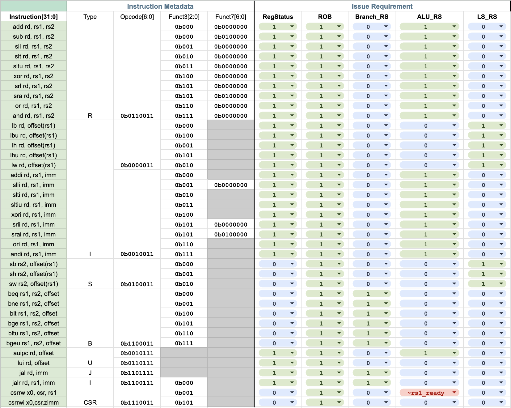

### Module breakdown
This section will explain how the modules work in detail.
#### Issue Block
<p align="center">
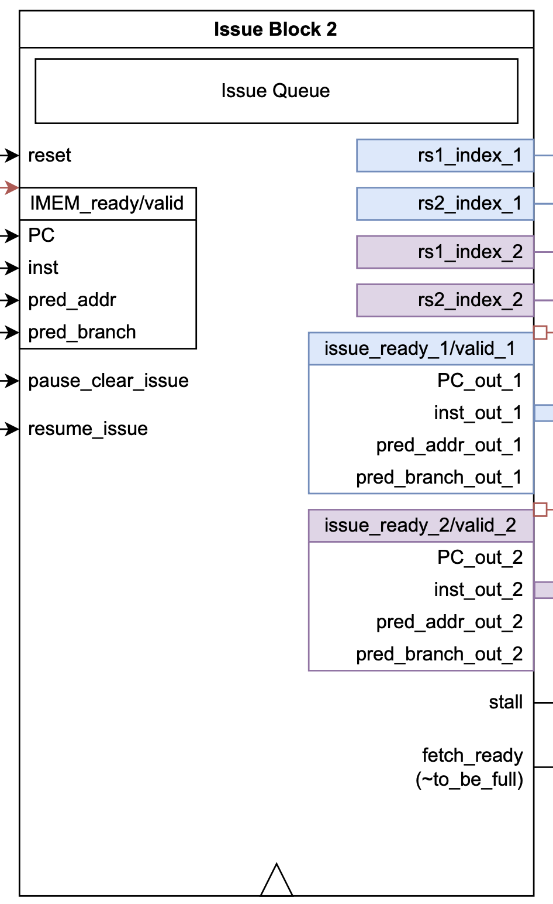
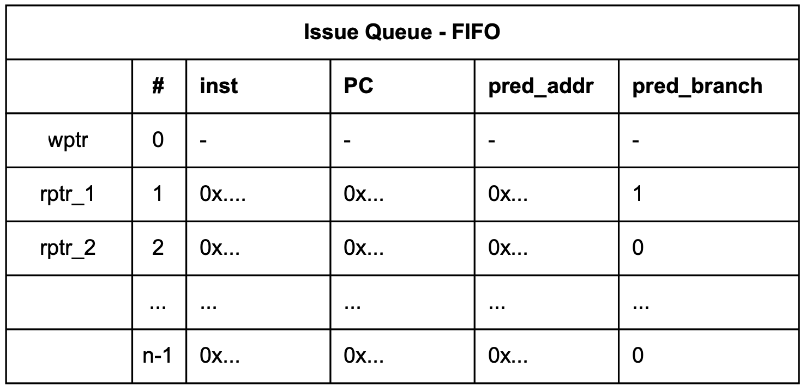
</p>

The issue block has a FIFO table for storing instructions received from instruction memory. Other information to be stored includes PC, predicted branching result, and predicted branching address if applicable. Our branch predictor currently only predicts branch or not, so we are not using the predicted address column (in red) in the FIFO table.

Issue block's output ports include 2 sets of issue-related information, namely the information stored in FIFO, rs1, and rs2 indexes. The two indexes will be sent to the register file, and register status table, to fetch the stored readiness of the operands and their stored values. 

Apart from the basic functions, the issue block is also optimized for special events like early branching and jal/jalr fetched. When a branch misprediction happens, the issue block will receive a high at the "pause_clear_issue" port then clear all its entries and transition into the PAUSE state. In the PAUSE state, no instruction will be issued to the downstream modules, but instruction fetch continues. When ROB finally processes the misprediction branch instruction, it will clear all RS, register status table, pipelined execution unit, and itself, as well as send a signal to the "resume_issue" port of the issue block to let it transition back to the NORMAL state. 

jal/jalr will always be treated as misprediction. So another optimization can be made: in the case where jal/jalr is enqueued, the issue block will transition to the STALL state - no instruction will be fetched in this state. Later when a jal/jalr or previously issued mispredicted branch instruction sends a "pause_clear_issue" signal. The issue block will transition back to the PAUSE state and start fetching new instructions again but stop issuing in the same time. Later a "resume_issue" will come to resume issue again.

Another special case is that in the PAUSE state, the issue block fetches a jal/jalr, and then it will transition to the PAUSE_STALL state that stops both fetching and issuing. When "resume_issue" comes it will go back to STALL and follow the same routine as described above.

Output ports "stall" and "fetch_ready" are sent to the fetch logic for controlling the instruction memory. Because we have a synchronous read memory, the input signal of memory is separated by two cycles from the output of the issue block. So we need to send a stop signal to IMEM when there is only one empty entry in the issue block, otherwise there is a chance a valid instruction couldn't be received by the issue block. In summary, all four states of the issue block are:
- NORMAL
- PAUSE
- STALL
- PAUSE_STALL

#### Fetch Logic
<p align="center">
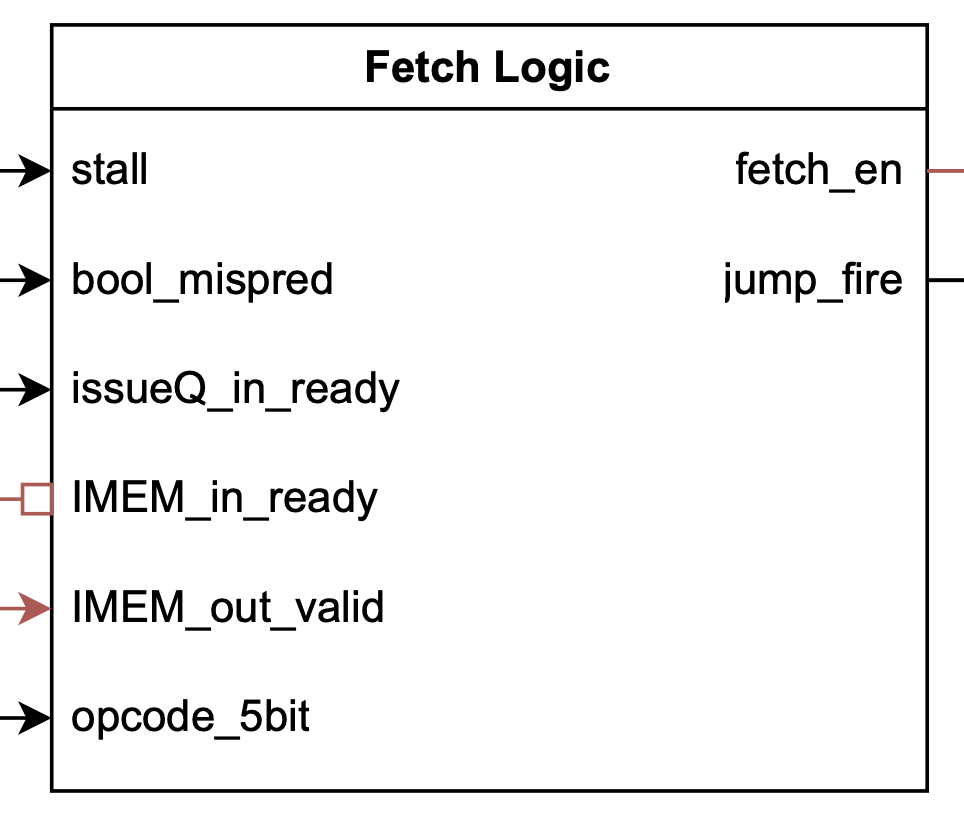
</p>

Fetch logic generates the control signal to control the PC register and instruction memory, as well as sends the "jump_fire" signal to the branch unit to let it move forward in case of a branch misprediction.

#### Register File
<p align="center">

</p>

The register file is modified for dual-issue. It now supports two simultaneous write and treats the second write port as coming later, such that the second write port can overwrite the first if they are writing to the same register. The async read ports are doubled as well. Now there are four of them.

#### Register Status Table
<p align="center">

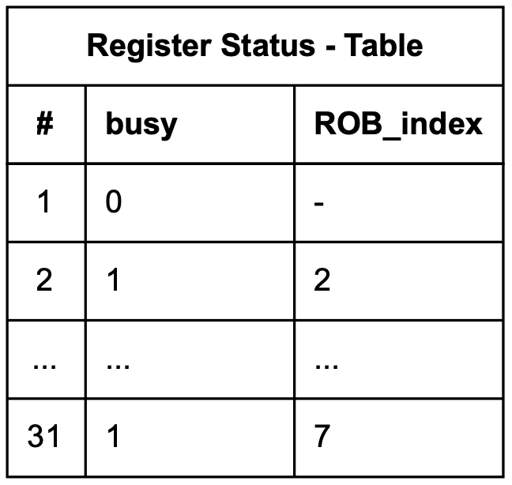
</p>

The register status table is for storing the ROB index that will produce the latest corresponding register result, which is one of the core components of the Tomasulo algorithm. For supporting dual issues, all read and write ports are doubled. The order preference is the same as the register file, the second port is always treated as later than the first. Because issue ports intrinsically have higher priority than commit ports, the write priority is issue_2 > issue_1 > commit_2 > commit_1.

During the issue stage, an inquiry with the ROB indexes will be sent to ROB to get the latest readiness and the values of the operands. After all the information is gathered, the final readiness and values will be produced by the register operand decoder. If any operand is not ready in the issue stage, the ROB index read from the register status table will also be issued to the corresponding RS together with the instruction. 

#### Register Operand Decoder
<p align="center">
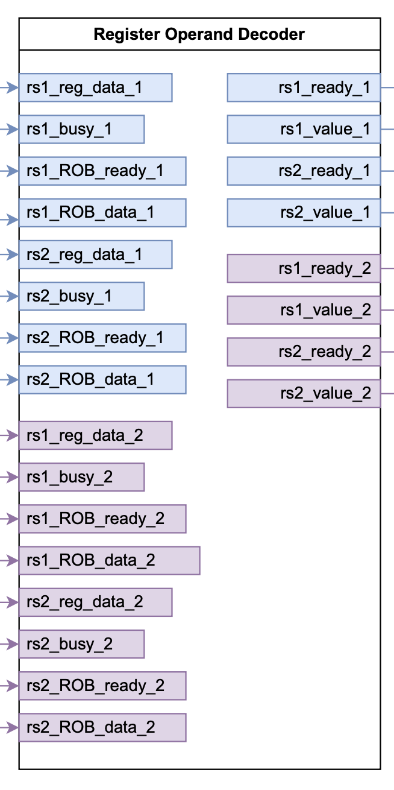
</p>

The register operand decoder is just for decoding the gathered information before the issue logic to alleviate its burden. In general, the rule is: if an operand busy signal is low, then set its ready signal to high and set the value to the register value, else if the busy signal is high but the ROB ready signal is high, then set the ready signal to high as well and set the value to the ROB value, otherwise, set the ready signal to low.

#### Issue Logic
<p align="center">
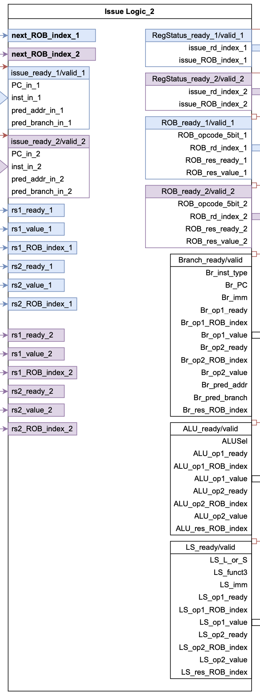
</p>

Issue logic will gather the instruction-related info from the issue block (PC, instruction, predicted branch, predicted address if applicable), the operand ready and value info from the register operand decoder, the next two ROB indexes, and the ready signals from all three RS and ROB. Note that ROB needs to provide two ready signals for two indexes. The issue logic will then issue zero, one, or two instructions depending on the modules' availabilities and instruction types. In the best scenario, if two instructions don't require the same RS and all RS and ROB are ready, they can be issued together. If all the required modules for the first instruction are ready but the second one is not or there is a conflict, then there will be only one instruction issued. If the first instruction doesn't satisfy the issue condition, no matter what the condition for the second one is, there will be no instruction issued. This is to preserve the instruction order recorded correctly in ROB. For the module dependency for each instruction, please refer to [Instruction issue requirement](###instruction-issue-requirement).

If issue logic issues two instructions in the same cycle, data forwarding logic needs to be implemented. When there is a dependency between the first instruction's rd and the second instruction's rs1/rs2. The ready signal, ROB index, and its value should be updated with the first instruction's relevant information.

#### Reorder Buffer (ROB)
<p align="center">
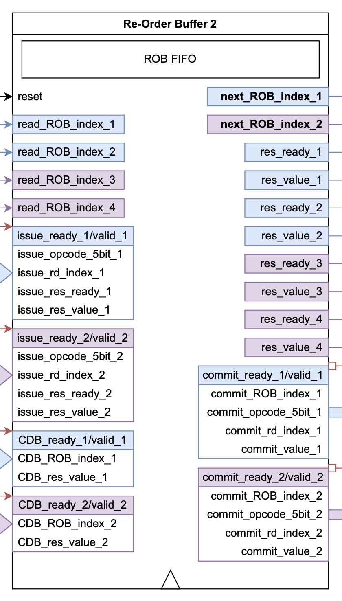
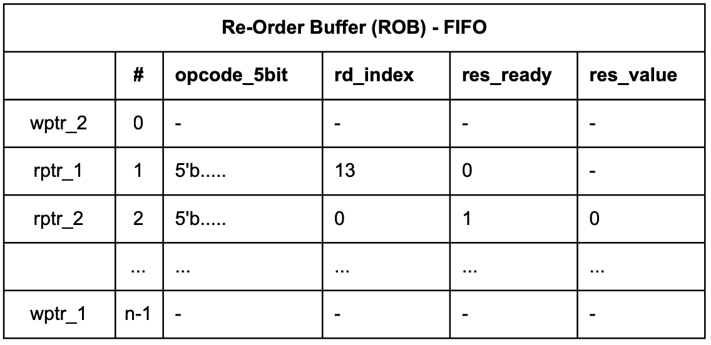
</p>

ROB doubles all the ports for dual-issue. It is a FIFO that supports double read and write one cycle. It will receive instruction info during the issue, such as opcode, rd index, result ready signal, and result value. Most instructions will set the result ready signal to low during issue, except for lui, csrrwi, and csrrw if rs1 is ready. When the result computation is done, it will be broadcasted on CDB and received by ROB. After that, the result ready will be set high and its value is the computed result (for branch instructions, the result is whether the branch is mispredicted, and store instructions don't care about result value). 

There are four read ports used during the issue stage to read the result from ROB if it is ready. The two next ROB index values are sent to issue logic for updating the register status table and the RS table. The two commit port sets are connected to the commit logic for extracting the committing signals such as register write enable signal, store trigger signal, CSR write enable signal, etc.

#### Commit Logic
<p align="center">
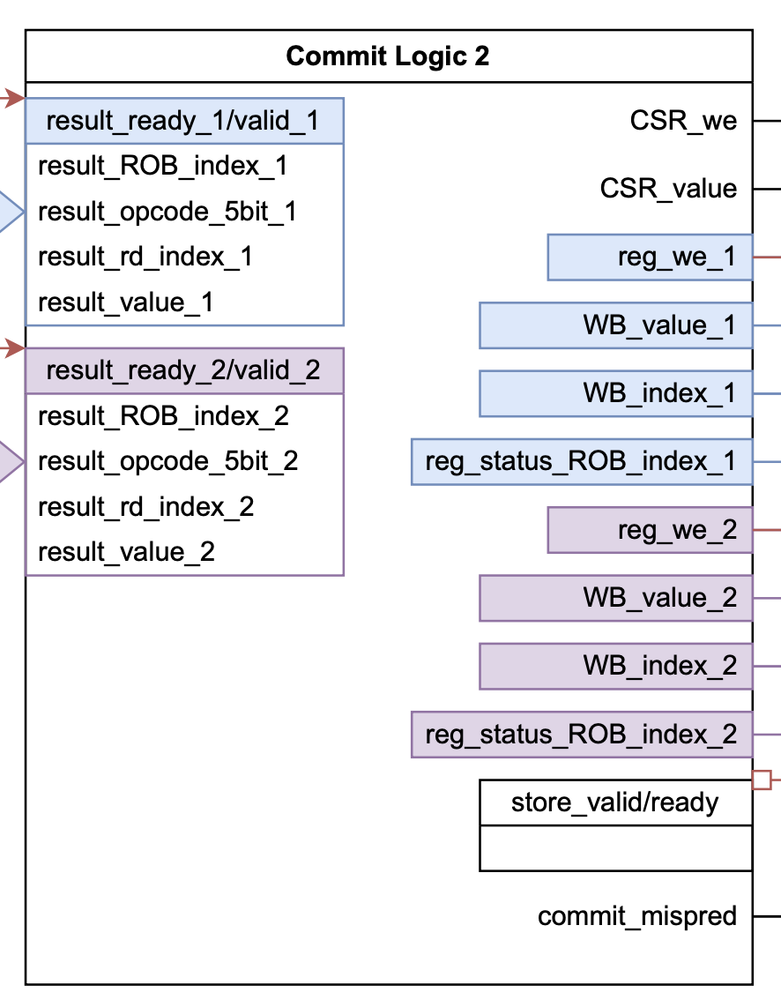
</p>

Commit logic receives two sets of commit-related data and produces one set of CSR control signals, two sets of register and register status commit signals, one set of store trigger handshake signals, and one misprediction commit signal. It will decide whether to trigger zero, one, or two commits based on the two sets of result valid signals and their types.

#### Branch Reservation Station (Branch RS)
<p align="center">
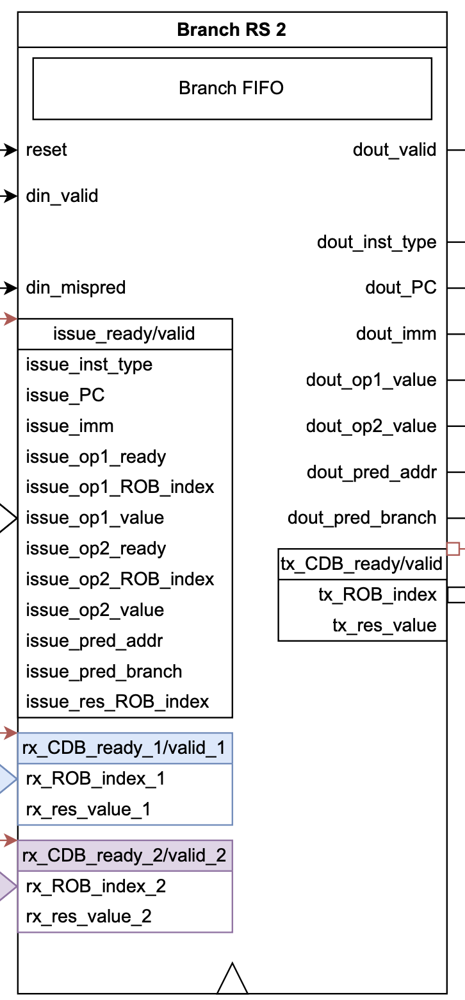
</p>
<p align="center">
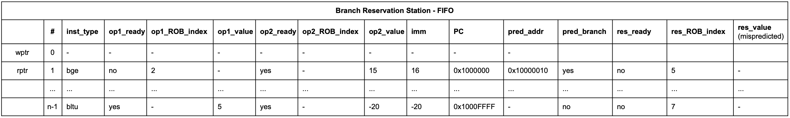
</p>

Branch RS is also a FIFO. B-type and jal/jalr will be sent here. We use funct3 of branch instructions to identify the specific types. Since B-type only occupies six of the eight available values, we let jal to occupy "3'b010" and jalr to occupy "3'b011". It receives the instruction info from the issue logic. Once the instruction has all the operands ready. It will be sent to the branch unit for execution. There is an additional pointer tracking the computing progress on top of the read pointer and write pointer (not shown in the table). If a misprediction for B-type happens or jal/jalr finishes execution, the FIFO write pointer will be set to the next computing pointer, such that when the read pointer processes all the above instructions the FIFO will be empty.

FIFO read is processed by the CDB write port. There are two parallel CDB read ports that always listen to the broadcast results. If it matches the operand ROB index, and the operand is still not ready, Branch RS will update the corresponding entry with the result and set it to be ready. In the case of an instruction being issued and its operand value being broadcasted by CDB, All RS should capture this dependency and update the operand with the CDB value.

#### Branch Unit
<p align="center">
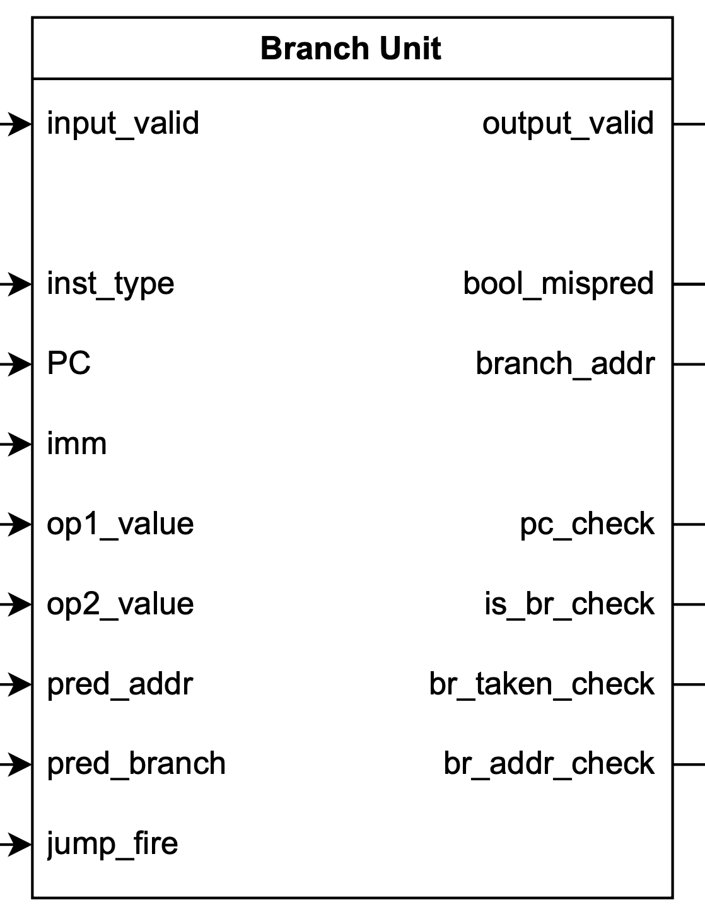
</p>

The Branch unit has an adder to compute the branch address, and a couple of comparators to decide whether to branch for B-type instructions. Once a B-type misprediction or jal/jalr is detected, it will send the correct PC address to the frontend. Once the correct address is to be read by instruction memory in the next cycle, a "jump_fire" signal is sent back to the Branch unit, such that the "output_valid" signal is asserted, and Branch RS is able to receive the misprediction result and move on.

#### ALU Reservation Station (ALU RS)
<p align="center">
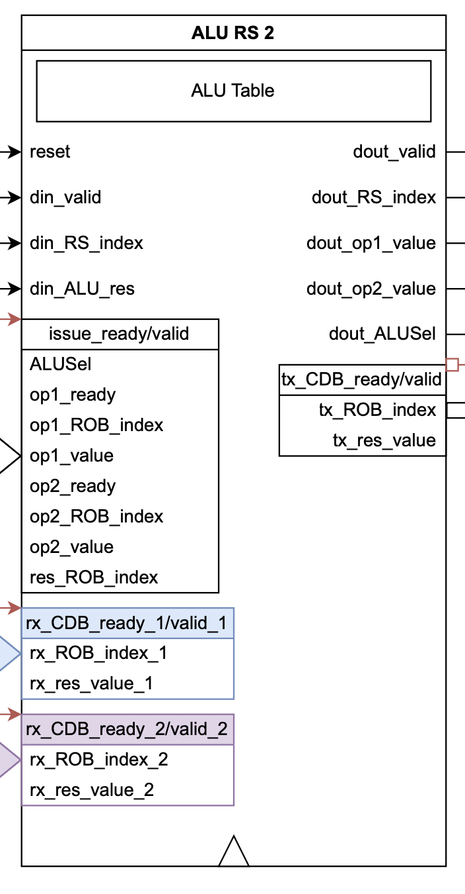
</p>
<p align="center">

</p>

ALU RS is different from the rest of RS. It doesn't use FIFO, instead, it uses a priority encoder to select the entry to write, compute, and send to CDB. The reason to choose a priority encoder is that it is easy to implement and the area is small. The starvation won't happen. If the top entry of ROB is waiting for the result from ALU RS, the ROB will gradually be full, allowing the ALU to clean out all the remaining ready entries in the next few cycles. In the end, ALU RS will send out the oldest instruction for execution. This approach will delay the pipeline in the worst case. However, if the ALU RS size is small, the delay can be mitigated.

#### ALU unit
<p align="center">
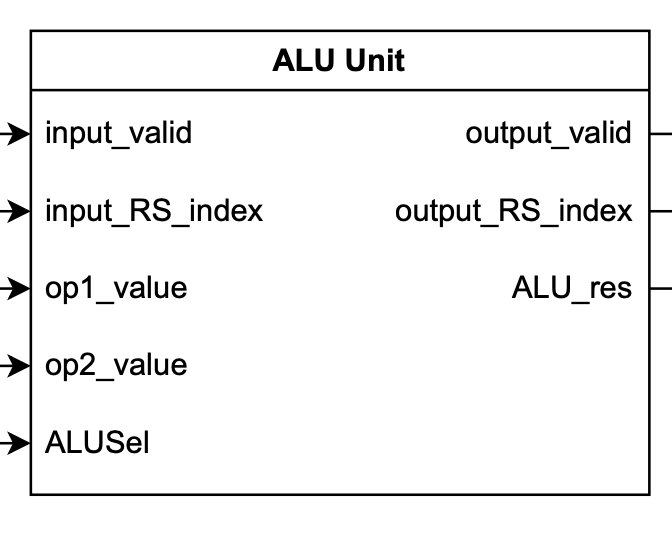
</p>

ALU unit is just an ordinary ALU with some extra information such as the ALU RS index and valid bit transmitted through. This design is easy to be adapted to pipeline stages in case other complicated ALU operations are to be added.

#### Load/Store Reservation Station (LS RS)
<p align="center">
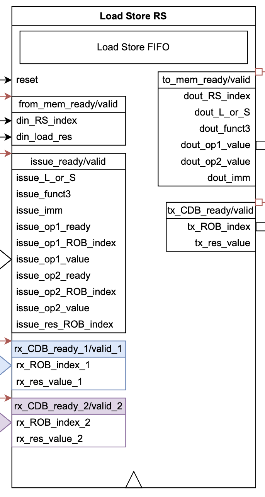
</p>
<p align="center">
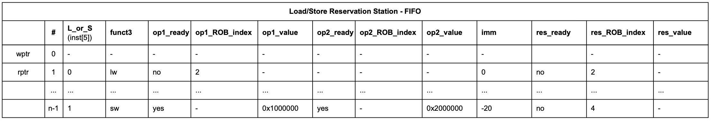
</p>

Load/Store RS is also a FIFO. This is to preserve the relative order of all load and store instructions. In general, it is very similar to Branch RS, except that it doesn't need a clear action - reset is enough. We use the sixth bit of instruction to distinguish load and store. Within load (store), we use funct3 to distinguish between lb/lbu/lh/lhu/lw (sb/sh/sw).

#### Memory Unit
<p align="center">
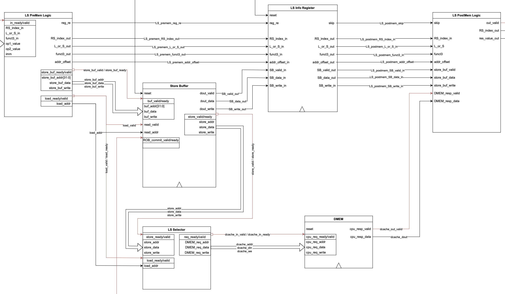
</p>
<p align="center">
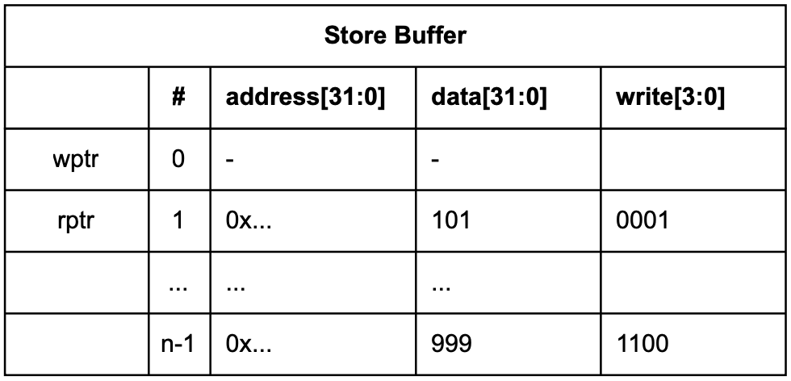
</p>

The memory unit, or load/store execution unit, has the most complicated structure among all three units. Because store instruction cannot be stored to the real memory system unless ROB commits it, the store instruction will just be sent to the store buffer that temporarily holds the store address, store value, and store write mask. LS RS will mark the store result as ready when the store is completed. In this way, LS RS can move on to later instructions. When the load instruction executes, it will check if the store buffer has the latest result at the same address, if so the data in the store buffer will overwrite the data loaded from memory and be transferred back to the LS RS. When the store instruction reaches the top of ROB, if it is ready, ROB will issue a valid signal to the store buffer to initiate the real store operation. Once the transaction is made, both ROB and store buffer will pop it from the top. We can clearly see that a FIFO is enough for the store buffer. Another thing to note is the real store action and the load instruction under execution will compete for the data memory access, we prioritize the store buffer to reduce the ROB commit time. 

#### CDB Arbiter
<p align="center">
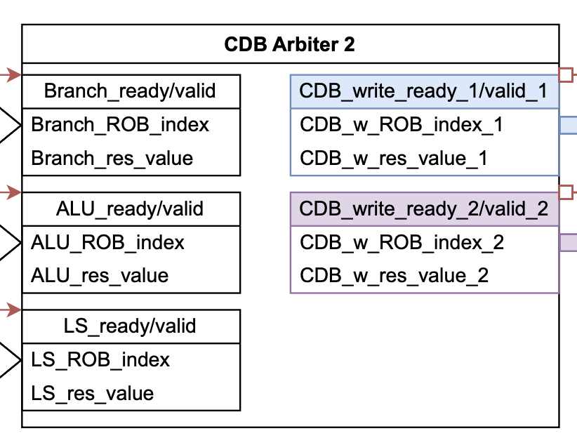
</p>

The CDB arbiter listens to the broadcast request from all three RS. It chooses up to two valid requests to broadcast on the CDB, which is monitored by all three RS and the ROB. We currently prioritize LS RS first, Branch RS second, and ALU RS last. Because load-store instructions take longer cycles to complete, LS RS is the most likely one to be full, thus it needs a faster turnaround time. Branch RS is the second because if a branch misprediction happens, we want it to be committed from ROB as soon as possible, so that the execution unit can start on meaningful tasks early. In reality, even for dual-issue, three requests are hardly all valid, so this priority setting is not causing noticeable delay.

#### Frontend
<p align="center">
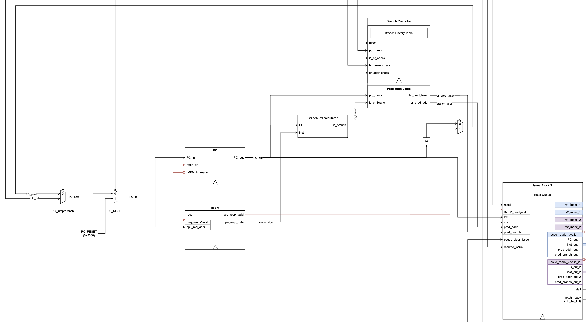
</p>

In the frontend, we are using a branch history table to predict branch is taken or not, as well as the latest branch address. By removing the branch address calculation in the fetch stage and only referencing the branch address from the history table, we get rid of 40% of our critical path (15ns to 9.05ns post-PAR). If a branch is predicted to be taken, we feedback the branch address to the input of instruction memory and PC register, such that we are able to smoothly jump to the new address without any stall. After the branch unit verifies the branching result, it will update the branch history table accordingly.

#### Reset Control
<p align="center">
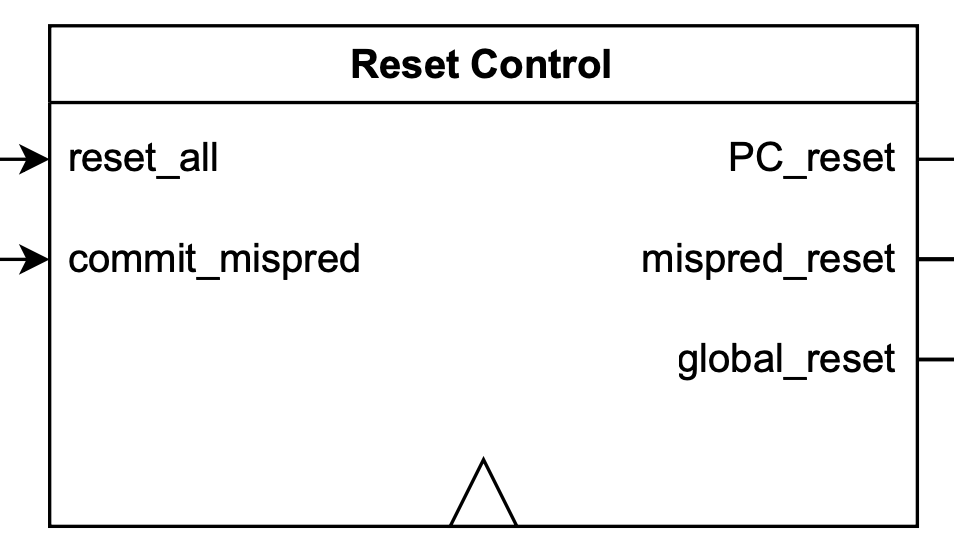
</p>

The reset control module has two input signals, one is the reset signal from the host, second is the "commit_mispred" signal from ROB committing mispredicted B-type or jal/jalr instructions. global reset is used to control the issue block, branch predictor, and CSR. It only reacts to the host reset signal. Host reset and "commit_mispred" both control "mispred_reset". This is used to reset everything after the issue block. PC_reset is only controlled by reset_all but delayed by one cycle, to be triggered after the reset of other tables is complete.


### Dual-issue test

After we integrated the real memory system including a cache with our CPU, we ran the "cachetest" benchmark and looked at the waveform. There is clear evidence that dual-issue helps to catch up with the delay caused by the memory system. The waveforms are put [here](docs/dual_issue_waveform). The full potential of our CPU can be realized if we can build a cache with two read ports, which we are running out of time to implement.

UPDATE: dual-fetch frontend including cache with two read ports has been implemented in branch [dual-fetch](https://github.com/EECS-151/asic-project-fa24-phhxh/tree/dual-fetch).


### Benchmarks (sim-rtl)

The cache uses a 128-bit cache line, 6-bit index, 20-bit tag, and 4-bit word offset (6-bit byte offset). For direct-mapped cache, the size is 4KiB. For a 2-way set associative cache, the size is 8KiB. Cache read hit takes 2 cycles. Cache write hit takes 3 cycles. Cache read miss following no write back load takes 6 cycles. Cache write miss following no write back load takes 7 cycles. Cache read miss following write back load takes 14 cycles. Cache write miss following write back load takes 15 cycles. The complete benchmark summary with different memory system is shown below. The cycle ratio of a real memory system to an ideal memory system on average is only 1.535 for both cache types. The ratio for the direct-mapped cache is 1.5350, and for the 2-way set associative cache is 1.5348, which only leads to minimal difference.

<p align="center">

</p>

### Post-Synthesis

Post-synthesis results are NOT up-to-date with the design, but changes are small and won't affect the overall picture. Synthesis documents are stored in [main/docs/syn_result](docs/syn_result). 

### Post-PAR

Post-PAR results are NOT up-to-date with the design, but changes are small and won't affect the overall picture. With the latest design we can slightly improve the clock to 9ns or even below it (to be verified). PAR documents are stored in [docs/par_result](docs/par_result). 

#### Direct-mapped cache

We are able to get 9.05ns clock period after PAR. The timing report is [here](main/docs/par_result/direct-mapped_cache/riscv_top_postRoute_all.tarpt). The total time required for running all benchmarks is:
```math
T_{total} = \sum N_{cycles} \times T_{clock} = 57,929,714 \times 9.05ns= 0.524s
```
Below is the screenshot of the floorplan.

<p align="center">
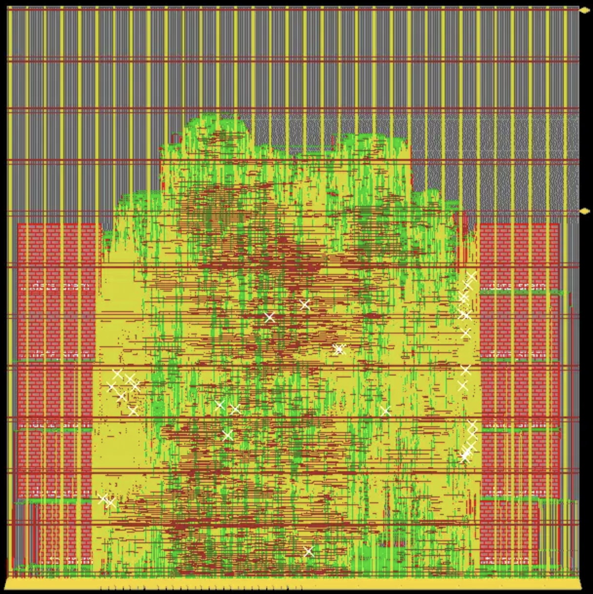
</p>

##### Benchmarks (sim-gl-par)

After running sim-gl-par for more than a day, we were able to pass all benchmarks after PAR with a slightly increased number of cycles. The result is shown below:

<p align="center">
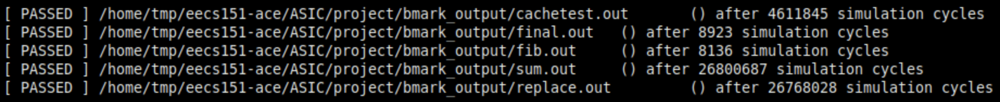
</p>

A more accurate post-PAR running time for benchmarks is:
```math
T_{par-total} = \sum N_{par-cycles} \times T_{clock} = 58,197,619 \times 9.05ns= 0.527s
```

#### 2-way set associative cache

We are able to get a 12.5ns clock period after par. The timing report is [here](main/docs/par_result/2-way_cache/riscv_top_postRoute_all.tarpt). It will be slower to run the benchmarks than the direct-mapped cache, so we just skip the calculation. Below is the screenshot of the floorplan.

<p align="center">
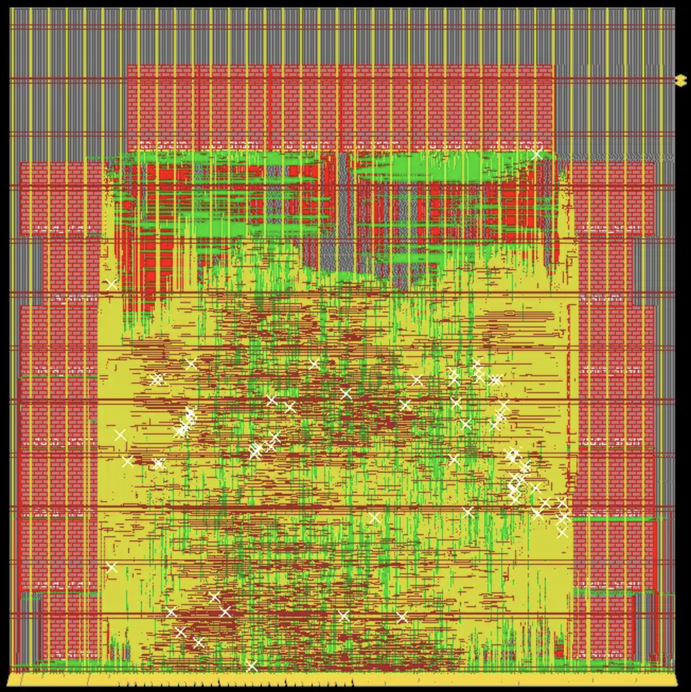
</p>

[Back to table of contents](##-table-of-contents)


## Version 1: Single-fetch dual-issue CPU with 1-cycle-read cache
This version implements cache with single-cycle-read and two-cycle-write if cache hits. The new cache version is stored in `src/Cache_cont.v`. Below is further experimental results with the continuous-cache.

### Single-Cycle-Read Test

Using the "final" benchmark as an example, we looked at the waveform and clearly identified pattern of single-cycle-read, i.e. the output valid signal can be high for multiple continuous cycles. The screenshots are stored [here](docs/cont_cache_waveform).

### Benchmarks (sim-rtl)

Almost everything is the same for the continous cache compared to the main branch version except that this version takes 1 cycle less for both write and read when cache hits. Below is the number of cycles needed for running all benchmarks with a direct-mapped continuous cache in RTL simulation. Compared to the number of cycles with the main branch cache, there is a 31% reduction.

<p align="center">
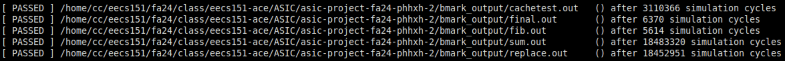
</p>

### Post-Synthesis

Synthesis documents are stored in [continuous-cache/docs/syn_result](continuous-cache/docs/syn_result). [Timing report](continuous-cache/docs/syn_result/direct-mapped_cache/11.5ns/final_time_ss_100C_1v60.setup_view.rpt) suggests timing is met.

#### Post-Synthesis Benchmarks (sim-gl-syn)

We picked a short benchmark, i.e. "final", to test post-synthesis gate-level simulation. Although we are able to pass, we saw timing violations during the simulation, the screenshot is [here](continuous-cache/docs/syn_result/direct-mapped_cache/11.5ns/test_bmark_final.png).


### Post-PAR

#### Direct-mapped cache

We are able to get 11.5ns clock period after PAR. The timing is met and timing report is [here](continuous-cache/docs/par_result/direct-mapped_cache/riscv_top_postRoute_all.tarpt). The total time required for running all benchmarks is:
```math
T_{total} = \sum N_{cycles} \times T_{clock} = 40,058,621 \times 11.5ns= 0.461s
```
Below is the screenshot of the floorplan.

<p align="center">

</p>

[Back to table of contents](##-table-of-contents)


## Version 2: Dual-fetch dual-issue CPU with 2-cycle-read cache

IMPORTANT: 
- There are two cache versions developed. The base version needs 2 cycles for read and 3 cycles for write if cache hits. `src/Cache.v` and `src/Cache_2.v` are implemented in this way. The second version reduces the number of cycles by 1 for both read and write if cache hits, but with a trade-off of longer clock period. `src/Cache_cont.v` and `src/Cache_cont_2.v` are implemented in the second way. For more details about the second cache version please refer to branch [continuous-cache](https://github.com/EECS-151/asic-project-fa24-phhxh/tree/continuous-cache). The default cache is the base version. The dual-fetch continuous cache is not faster than single-fetch continuous cache. A speculation on the cause is that the number of cycles is likely memory-bound, i.e. limited by the number of cycles needed for sequential memory operations within the data cache.

### Full design diagram
A PDF version with clear details can be found [here](dual-fetch/docs/dual_fetch_diagram.pdf)! Comparing to the main branch version, this version only implements dual-fetch frontend on top of the dual-issue backend.


### Dual-fetch frontend

<p align="center">
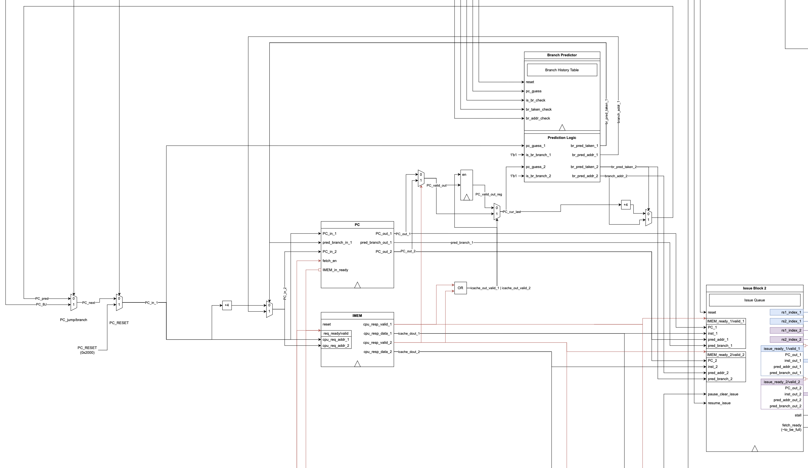
</p>

The dual-fetch frontend is able to supply two PC addresses to the instruction memory (IMEM or icache). The first instruction has three possibile sources, namely feedback branch prediction address, actual branch address from the branch unit when there is misprediction, and reset PC address. This part is the same as single-fetch frontend. The second IMEM input instruction is chosen between branch predictor's prediction and regular PC+4. The PC_reg_2 will output both PC addresses and first PC's branch prediction result. The second PC can serve as the first PC's predicted address.

The IMEM or icache will take two PC adresses when it is ready. It undergoes the same instruction fetch workflow as the single-fetch cache. This makes the second instruction's availability dependent on the address difference compared with the first instruction. It is related to how cache reads data. The cache we use has four data SRAMs to be read simultaneously. The third and the fourth digit of the 32-bit address (addr[3:2]) encodes which SRAM has the desired data. This makes it possible to look at two different SRAMs in the same data fetch cycle. So icache checks if the upper bits of the address (addr[31:4]) is the same for both input PC, if so icache outputs both data and mark them valid. If this condition doesn't hold, then icache only outputs the first valid instruction.

This scheme is good enough to continuously output two adjacent instructions in the same fetch cycle. Assume two adjacent PC addresses PC_in and PC_in+4 are not boundary aligned, i.e. addr[31:4] is not the same, then next instruction fetch cycle icache only outputs the instruction corresponds to PC_in. This single fetch cycle actually corrects the misalignment, so in the following cycles the two PC addresses are all aligned as long as no branch taking prediction is made or no misprediction happens. 

In the case of a predicted branch, if it is fed into the second PC slot, and it is not aligned with the first PC (very likely), then next fetch cycle will only output one valid instruction. Following that a new prediction will be made based on the latest branch history table. The new prediction will serve as the first PC into icache, while the second PC is the next instruction (+4) assuming no continous branch prediction is made (very likely). In the worst case these two PC addresses are also not aligned, so one additional fetch cycle will only output one valid instruction. Following that will be aligned adjacent PC addresses fed into the icache, so the number of valid instructions in each fetch cycle will be increases to two, until the next branch. In summary of the above discussion, the predicted branch can take up to two fetch cycles that icache outputs only one valid instruction, which is totally acceptable.

In the case of a misprediction, the branch address will always sit at the first PC slot, thus at most one fetch cycle will only output one valid instruction to correct for possible misaglinment.


### Dual-fetch test

Using the "final" benchmark as an example, we looked at the waveform and clearly identified dual-fetch pattern. The screenshots are stored [here](dual-fetch/docs/dual_fetch_waveform).

## Benchmarks (sim-rtl)

We run the benchmarks with direct-mapped cache. The result is shown below. Comparing to the single-fetch result (main branch), the number of cycles is reduced by 13.4%.

<p align="center">
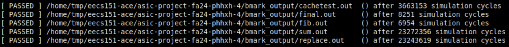
</p>

### Post-PAR

Post-PAR results are NOT up-to-date with the design, but changes are small and won't affect the overall picture. PAR documents are stored in [dual-fetch/docs/par_result](dual-fetch/docs/par_result).

#### Direct-mapped cache

Because 2-way set associative cache doesn't offer better performance for benchmarks, we only PARed direct-mapped cache. We are able to get 9.75ns clock period after PAR. Compared to the single-fetch cpu (main branch), the clock period increased by 0.7ns. The timing report is [here](docs/par_result/direct-mapped_cache/riscv_top_postRoute_all.tarpt). The total time required for running all benchmarks is:
```math
T_{total} = \sum N_{cycles} \times T_{clock} = 50,194,333 \times 9.75ns= 0.489s
```
Compared to the single-fetch cpu, the total time is reduced by 0.035s. Below is the screenshot of the floorplan.

<p align="center">
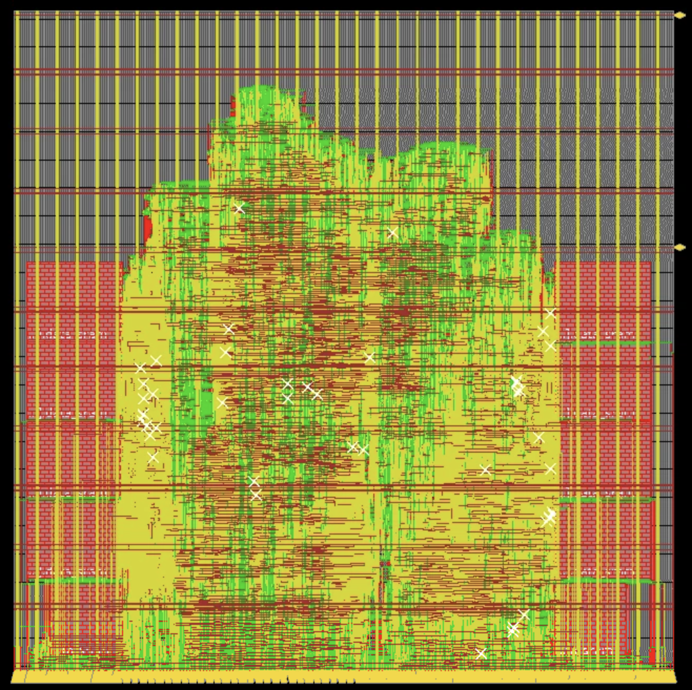
</p>

[Back to table of contents](##-table-of-contents)
