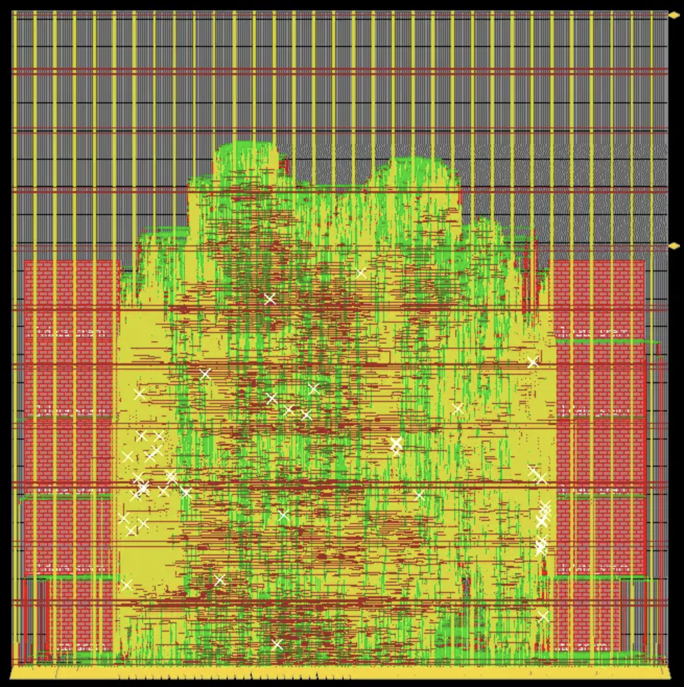

# Design of a dual-issue out-of-order execution RISC-V CPU with branch predictor
Members: Shuqi Xu, Andris Huang

IMPORTANT: This branch implements cache with single-cycle-read and two-cycle-write if cache hits. The new cache version is stored in `src/Cache_cont.v`. Below is further experimental results with the continuous-cache.

## Single-Cycle-Read Test

Using the "final" benchmark as an example, we looked at the waveform and clearly identified pattern of single-cycle-read, i.e. the output valid signal can be high for multiple continuous cycles. The screenshots are stored [here](docs/cont_cache_waveform).

## Benchmarks (sim-rtl)

Almost everything is the same for the continous cache compared to the main branch version except that this version takes 1 cycle less for both write and read when cache hits. Below is the number of cycles needed for running all benchmarks with a direct-mapped continuous cache in RTL simulation. Compared to the number of cycles with the main branch cache, there is a 31% reduction.

<p align="center">

</p>

## Post-Synthesis

Synthesis documents are stored in [docs/syn_result](docs/syn_result). [Timing report](docs/syn_result/direct-mapped_cache/11.5ns/final_time_ss_100C_1v60.setup_view.rpt) suggests timing is met.

### Post-Synthesis Benchmarks (sim-gl-syn)

We picked a short benchmark, i.e. "final", to test post-synthesis gate-level simulation. Although we are able to pass, we saw timing violations during the simulation, the screenshot is [here](docs/syn_result/direct-mapped_cache/11.5ns/test_bmark_final.png).


## Post-PAR

### Direct-mapped cache

We are able to get 11.5ns clock period after PAR. The timing is met and timing report is [here](docs/par_result/direct-mapped_cache/riscv_top_postRoute_all.tarpt). The total time required for running all benchmarks is:
```math
T_{total} = \sum N_{cycles} \times T_{clock} = 40,058,621 \times 11.5ns= 0.461s
```
Below is the screenshot of the floorplan.

<p align="center">

</p>

#### Benchmarks (sim-gl-par)

Post-PAR gate-level simulation failed. To be debugged.

