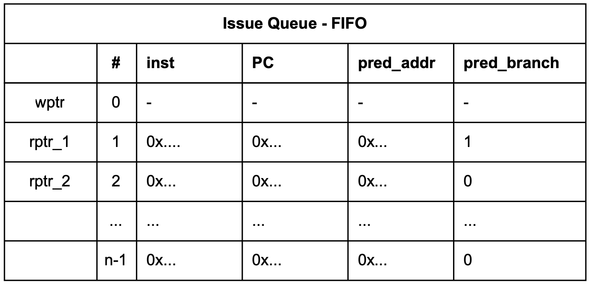
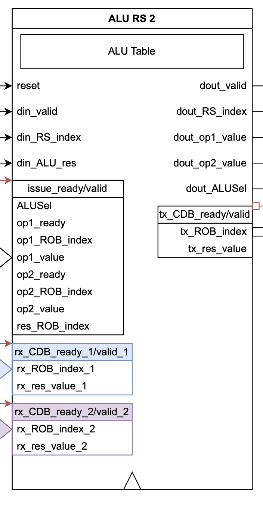
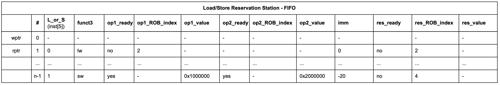
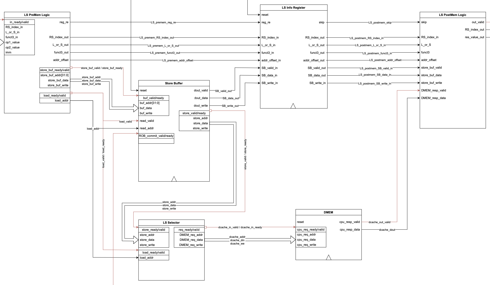
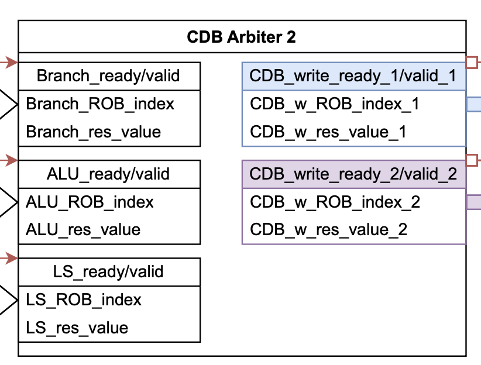
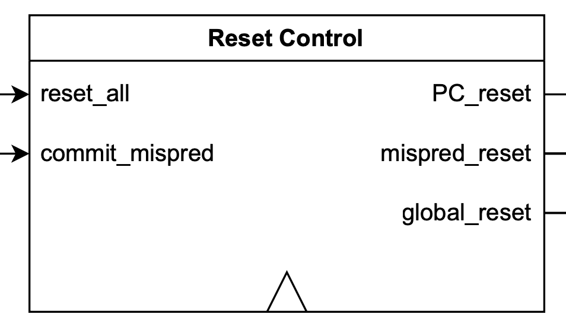

# Backend
{: .no_toc}

This section explains backend modules' functionality in detail.

## Table of Contents
{: .no_toc .text-delta }

1. TOC
{:toc}

## Full design diagram

To give a clear whole picture of the backend, we also provide the full design diagrams with single-fetch and dual-fetch frontend below for reference.

### With single-fetch frontend

A PDF version with clear details can be found [here](../frontend/single-fetch/single-fetch_diagram.pdf).

### With dual-fetch frontend

A PDF version with clear details can be found [here](../frontend/dual-fetch/dual-fetch_diagram.pdf).

## Module breakdown

### Issue block

The issue block has a FIFO table for storing instructions received from instruction memory. Other information to be stored includes PC, predicted branching result, and predicted branching address if applicable. Our branch predictor currently only predicts branch or not, so we are not using the predicted address column (in red) in the FIFO table.

Issue block's output ports include 2 sets of issue-related information, namely the information stored in FIFO, rs1, and rs2 indexes. The two indexes will be sent to the register file, and register status table, to fetch the stored readiness of the operands and their stored values. 

Apart from the basic functions, the issue block is also optimized for special events like early branching and jal/jalr fetched. When a branch misprediction happens, the issue block will receive a high at the "pause_clear_issue" port then clear all its entries and transition into the PAUSE state. In the PAUSE state, no instruction will be issued to the downstream modules, but instruction fetch continues. When ROB finally processes the misprediction branch instruction, it will clear all RS, register status table, pipelined execution unit, and itself, as well as send a signal to the "resume_issue" port of the issue block to let it transition back to the NORMAL state. 

jal/jalr will always be treated as misprediction. So another optimization can be made: in the case where jal/jalr is enqueued, the issue block will transition to the STALL state - no instruction will be fetched in this state. Later when a jal/jalr or previously issued mispredicted branch instruction sends a "pause_clear_issue" signal. The issue block will transition back to the PAUSE state and start fetching new instructions again but stop issuing in the same time. Later a "resume_issue" will come to resume issue again.

Another special case is that in the PAUSE state, the issue block fetches a jal/jalr, and then it will transition to the PAUSE_STALL state that stops both fetching and issuing. When "resume_issue" comes it will go back to STALL and follow the same routine as described above.

Output ports "stall" and "fetch_ready" are sent to the fetch logic for controlling the instruction memory. Because we have a synchronous read memory, the input signal of memory is separated by two cycles from the output of the issue block. So we need to send a stop signal to IMEM when there is only one empty entry in the issue block, otherwise there is a chance a valid instruction couldn't be received by the issue block. In summary, all four states of the issue block are:
- NORMAL
- PAUSE
- STALL
- PAUSE_STALL

### Register file

The register file is modified for dual-issue. It now supports two simultaneous write and treats the second write port as coming later, such that the second write port can overwrite the first if they are writing to the same register. The async read ports are doubled as well. Now there are four of them.

### Register status table

The register status table is for storing the ROB index that will produce the latest corresponding register result, which is one of the core components of the Tomasulo algorithm. For supporting dual issues, all read and write ports are doubled. The order preference is the same as the register file, the second port is always treated as later than the first. Because issue ports intrinsically have higher priority than commit ports, the write priority is issue_2 > issue_1 > commit_2 > commit_1.

During the issue stage, an inquiry with the ROB indexes will be sent to ROB to get the latest readiness and the values of the operands. After all the information is gathered, the final readiness and values will be produced by the register operand decoder. If any operand is not ready in the issue stage, the ROB index read from the register status table will also be issued to the corresponding RS together with the instruction. 

### Register operand decoder

The register operand decoder is just for decoding the gathered information before the issue logic to alleviate its burden. In general, the rule is: if an operand busy signal is low, then set its ready signal to high and set the value to the register value, else if the busy signal is high but the ROB ready signal is high, then set the ready signal to high as well and set the value to the ROB value, otherwise, set the ready signal to low.

### Issue logic

Issue logic will gather the instruction-related info from the issue block (PC, instruction, predicted branch, predicted address if applicable), the operand ready and value info from the register operand decoder, the next two ROB indexes, and the ready signals from all three RS and ROB. Note that ROB needs to provide two ready signals for two indexes. The issue logic will then issue zero, one, or two instructions depending on the modules' availabilities and instruction types. In the best scenario, if two instructions don't require the same RS and all RS and ROB are ready, they can be issued together. If all the required modules for the first instruction are ready but the second one is not or there is a conflict, then there will be only one instruction issued. If the first instruction doesn't satisfy the issue condition, no matter what the condition for the second one is, there will be no instruction issued. This is to preserve the instruction order recorded correctly in ROB. For the module dependency for each instruction, please refer to [Instruction issue requirement](#instruction-issue-requirement).

If issue logic issues two instructions in the same cycle, data forwarding logic needs to be implemented. When there is a dependency between the first instruction's rd and the second instruction's rs1/rs2. The ready signal, ROB index, and its value should be updated with the first instruction's relevant information.

### Reorder buffer (ROB)

ROB doubles all the ports for dual-issue. It is a FIFO that supports double read and write one cycle. It will receive instruction info during the issue, such as opcode, rd index, result ready signal, and result value. Most instructions will set the result ready signal to low during issue, except for lui, csrrwi, and csrrw if rs1 is ready. When the result computation is done, it will be broadcasted on CDB and received by ROB. After that, the result ready will be set high and its value is the computed result (for branch instructions, the result is whether the branch is mispredicted, and store instructions don't care about result value). 

There are four read ports used during the issue stage to read the result from ROB if it is ready. The two next ROB index values are sent to issue logic for updating the register status table and the RS table. The two commit port sets are connected to the commit logic for extracting the committing signals such as register write enable signal, store trigger signal, CSR write enable signal, etc.

### Commit logic

Commit logic receives two sets of commit-related data and produces one set of CSR control signals, two sets of register and register status commit signals, one set of store trigger handshake signals, and one misprediction commit signal. It will decide whether to trigger zero, one, or two commits based on the two sets of result valid signals and their types.

### Branch reservation station (Branch RS)

Branch RS is also a FIFO. B-type and jal/jalr will be sent here. We use funct3 of branch instructions to identify the specific types. Since B-type only occupies six of the eight available values, we let jal to occupy "3'b010" and jalr to occupy "3'b011". It receives the instruction info from the issue logic. Once the instruction has all the operands ready. It will be sent to the branch unit for execution. There is an additional pointer tracking the computing progress on top of the read pointer and write pointer (not shown in the table). If a misprediction for B-type happens or jal/jalr finishes execution, the FIFO write pointer will be set to the next computing pointer, such that when the read pointer processes all the above instructions the FIFO will be empty.

FIFO read is processed by the CDB write port. There are two parallel CDB read ports that always listen to the broadcast results. If it matches the operand ROB index, and the operand is still not ready, Branch RS will update the corresponding entry with the result and set it to be ready. In the case of an instruction being issued and its operand value being broadcasted by CDB, All RS should capture this dependency and update the operand with the CDB value.

### Branch unit

The Branch unit has an adder to compute the branch address, and a couple of comparators to decide whether to branch for B-type instructions. Once a B-type misprediction or jal/jalr is detected, it will send the correct PC address to the frontend. Once the correct address is to be read by instruction memory in the next cycle, a "jump_fire" signal is sent back to the Branch unit, such that the "output_valid" signal is asserted, and Branch RS is able to receive the misprediction result and move on.

### ALU reservation station (ALU RS)

ALU RS is different from the rest of RS. It doesn't use FIFO, instead, it uses a priority encoder to select the entry to write, compute, and send to CDB. The reason to choose a priority encoder is that it is easy to implement and the area is small. The starvation won't happen. If the top entry of ROB is waiting for the result from ALU RS, the ROB will gradually be full, allowing the ALU to clean out all the remaining ready entries in the next few cycles. In the end, ALU RS will send out the oldest instruction for execution. This approach will delay the pipeline in the worst case. However, if the ALU RS size is small, the delay can be mitigated.

### ALU

ALU is just an ordinary ALU with some extra information such as the ALU RS index and valid bit transmitted through. This design is easy to be adapted to pipeline stages in case other complicated ALU operations are to be added.

### Load/Store reservation station (LS RS)

Load/Store RS is also a FIFO. This is to preserve the relative order of all load and store instructions. In general, it is very similar to Branch RS, except that it doesn't need a clear action - reset is enough. We use the sixth bit of instruction to distinguish load and store. Within load (store), we use funct3 to distinguish between lb/lbu/lh/lhu/lw (sb/sh/sw).

### Memory unit

The memory unit, or load/store execution unit, has the most complicated structure among all three units. Because store instruction cannot be stored to the real memory system unless ROB commits it, the store instruction will just be sent to the store buffer that temporarily holds the store address, store value, and store write mask. LS RS will mark the store result as ready when the store is completed. In this way, LS RS can move on to later instructions. When the load instruction executes, it will check if the store buffer has the latest result at the same address, if so the data in the store buffer will overwrite the data loaded from memory and be transferred back to the LS RS. When the store instruction reaches the top of ROB, if it is ready, ROB will issue a valid signal to the store buffer to initiate the real store operation. Once the transaction is made, both ROB and store buffer will pop it from the top. We can clearly see that a FIFO is enough for the store buffer. Another thing to note is the real store action and the load instruction under execution will compete for the data memory access, we prioritize the store buffer to reduce the ROB commit time. 

### CDB arbiter

The CDB arbiter listens to the broadcast request from all three RS. It chooses up to two valid requests to broadcast on the CDB, which is monitored by all three RS and the ROB. We currently prioritize LS RS first, Branch RS second, and ALU RS last. Because load-store instructions take longer cycles to complete, LS RS is the most likely one to be full, thus it needs a faster turnaround time. Branch RS is the second because if a branch misprediction happens, we want it to be committed from ROB as soon as possible, so that the execution unit can start on meaningful tasks early. In reality, even for dual-issue, three requests are hardly all valid, so this priority setting is not causing noticeable delay.

### Reset control

The reset control module has two input signals, one is the reset signal from the host, second is the "commit_mispred" signal from ROB committing mispredicted B-type or jal/jalr instructions. global reset is used to control the issue block, branch predictor, and CSR. It only reacts to the host reset signal. Host reset and "commit_mispred" both control "mispred_reset". This is used to reset everything after the issue block. PC_reset is only controlled by reset_all but delayed by one cycle, to be triggered after the reset of other tables is complete.

## Dual-issue test

We ran the "cachetest" benchmark with the 2-cyc cache single-fetch frontend and looked at the waveform. There is clear evidence that dual-issue helps to catch up with the delay caused by the memory system. The waveforms are put [here](dual-issue_waveform). Below shows a zoomed-in waveform.

## Default table depth

Here summarizes the default table depth used in this project. One can assume all the following results are based on this configuration unless specifically stated.

| Table name   | Depth              |
|:-------------|:-------------------|
| BHT/BTB      | 16 (direct-mapped) |
| Issue block  | 8                  |
| ROB          | 8                  |
| Branch RS    | 4                  |
| ALU RS       | 4                  |
| LS RS        | 4                  |
| Store buffer | 4                  |