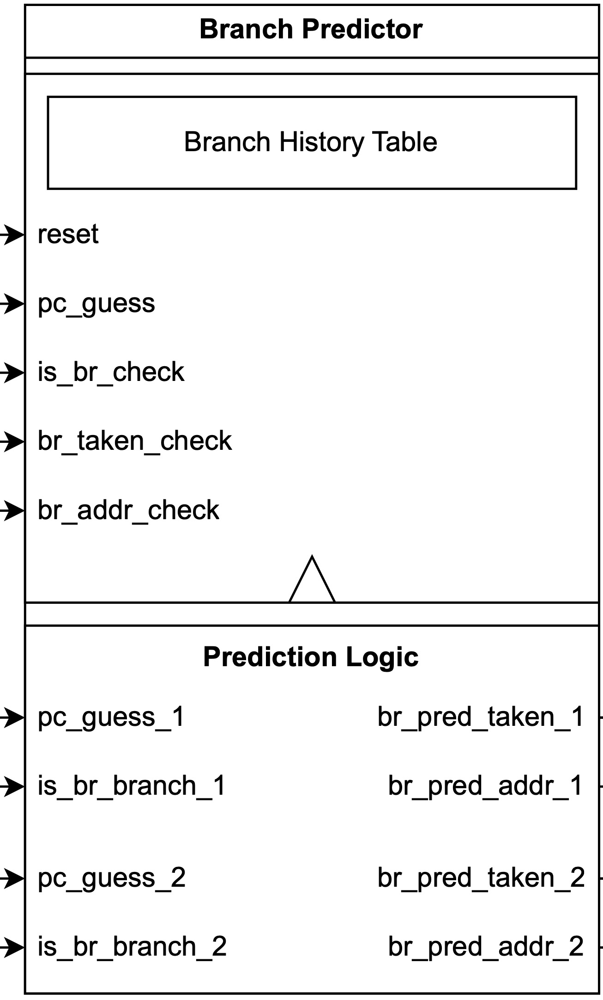

# Dual-fetch
{: .no_toc }

This section provides some technical details about the Dual-fetch frontend.

## Full design diagram with Dual-fetch frontend

The design diagram is the same as the diagram provided in the backend section. A PDF version with clear details can be found [here](dual-fetch_diagram.pdf).

## Dual-fetch frontend

The dual-fetch frontend is able to supply two PC addresses to the instruction memory (IMEM or icache). The first instruction has three possibile sources, namely feedback branch prediction address, actual branch address from the branch unit when there is misprediction, and reset PC address. This part is the same as single-fetch frontend. The second IMEM input instruction is chosen between branch predictor's prediction and regular PC+4. The PC_reg_2 will output both PC addresses and first PC's branch prediction result. The second PC can serve as the first PC's predicted address.

The IMEM or icache will take two PC adresses when it is ready. It undergoes the same instruction fetch workflow as the single-fetch cache. For an ideal memory, it always output two valid words in the same cycle. But for caches, this makes the second instruction's availability dependent on the address difference compared with the first instruction. It is related to how cache reads data. The cache we use has four data SRAMs to be read simultaneously. The third and the fourth digit of the 32-bit address (addr[3:2]) encodes which SRAM has the desired data. This makes it possible to look at two different SRAMs in the same data fetch cycle. So icache checks if the upper bits of the address (addr[31:4]) is the same for both input PC, if so icache outputs both data and mark them valid. If this condition doesn't hold, then icache only outputs the first valid instruction.

This scheme is good enough to continuously output two adjacent instructions in the same fetch cycle. Assume two adjacent PC addresses PC_in and PC_in+4 are not boundary aligned, i.e. addr[31:4] is not the same, then next instruction fetch cycle icache only outputs the instruction corresponds to PC_in. This single fetch cycle actually corrects the misalignment, so in the following cycles the two PC addresses are all aligned as long as no branch taking prediction is made or no misprediction happens. 

In the case of a predicted branch, if it is fed into the second PC slot, and it is not aligned with the first PC (very likely), then next fetch cycle will only output one valid instruction. Following that a new prediction will be made based on the latest branch history table. The new prediction will serve as the first PC into icache, while the second PC is the next instruction (+4) assuming no continous branch prediction is made (very likely). In the worst case these two PC addresses are also not aligned, so one additional fetch cycle will only output one valid instruction. Following that will be aligned adjacent PC addresses fed into the icache, so the number of valid instructions in each fetch cycle will be increases to two, until the next branch. In summary of the above discussion, the predicted branch can take up to two fetch cycles that icache outputs only one valid instruction, which is totally acceptable.

In the case of a misprediction, the branch address will always sit at the first PC slot, thus at most one fetch cycle will only output one valid instruction to correct for possible misaglinment.

### Branch predictor

Compared to the single-fetch branch predictor, the difference is the additional set of prediction ports to support dual branch prediction in the same cycle.