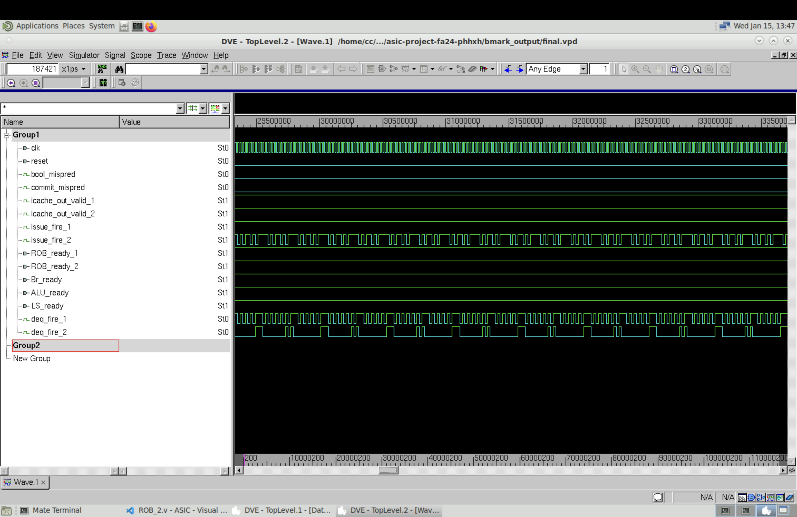

# Ideal memory
{: .no_toc }

Ideal memory is a synchronous component and it always gets the action done the following cycle. Ideal memory only exists in RTL. We have modified the ideal memory to be able to output two words in the same cycle.

## Table of Contents
{: .no_toc .text-delta }

1. TOC
{:toc}

## Benchmarks (sim-rtl)

Compared to the single-fetch ideal memory version, there is no noticeble speedup just like the dual-fetch 1-cyc version compared to the single-fetch 1-cyc version. To further investigate this, we set the table sizes of ROB, RS (including store buffer) to be big enough, such that the frontend will never be able to fill all entries, and the three backend execution units will always process instructions. Then we look at the final benchmark waveform shown below.

From the waveform we can see that the issue speed (`issue_fire_1` and `issue_fire_2` at high) is faster than ROB commit speed (`deq_fire_1` and `deq_fire_2` at high). Since the speed is not limited by issue, and branch misprediction rate is low given that we have a BHT/BTB, this is a clear indication that data hazard through memory execution (longest among all execution units) is the bottleneck. 

To further improve the speed and utilize the dual-issue backend more, two straightforward (not easy) improvements can be made. First is to speculatively execute load/store. The trade-off is a larger penalty if speculation is wrong. Second is to reduce data dependencies on the compiler side, which is beyond our consideration in this project.

PS: unfortunately we don't have screenshot and we can no longer take it because the access to the instructional account is removed.