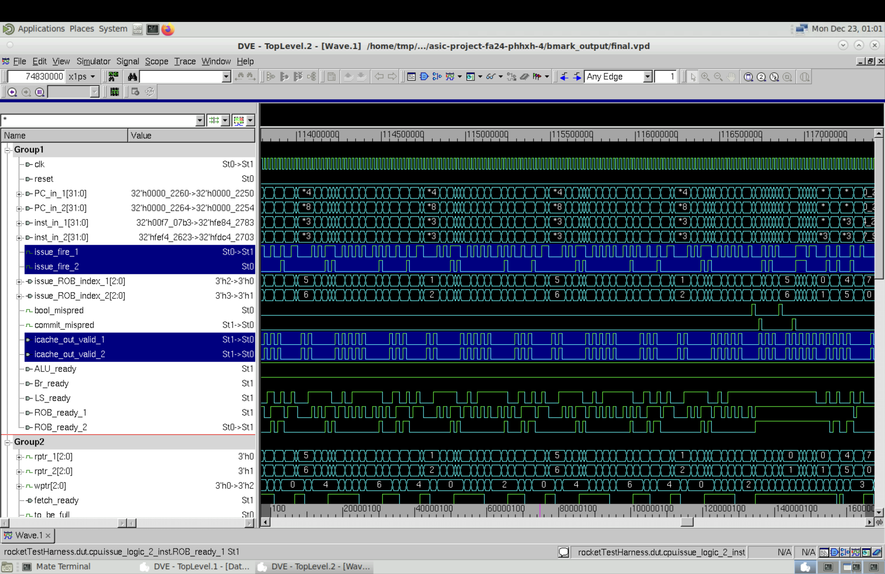
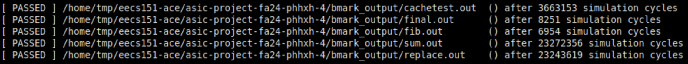
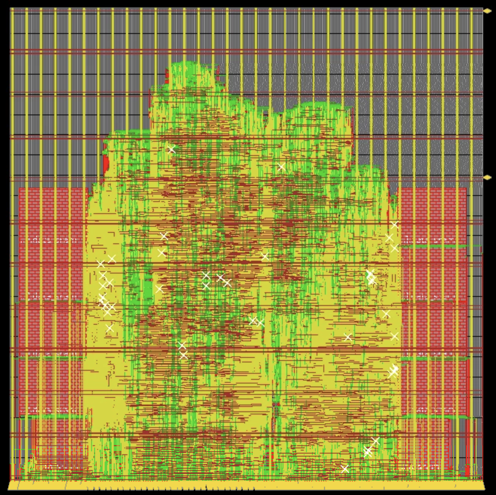

# 2-cyc cache
{: .no_toc }

## Table of Contents
{: .no_toc .text-delta }

1. TOC
{:toc}

### Dual-fetch test

Using the "final" benchmark as an example, we looked at the waveform and clearly identified dual-fetch pattern. The screenshots are stored [here](dual-fetch_waveform). Below shows a zoomed-in waveform. `icache_out_valid_1` and `icache_out_valid_2` are the two output valid signals from icache. They can be high in the same cycle.

<p align="center">

</p>

## Benchmarks (sim-rtl)

### Direct-mapped cache

The total number of cycles to run all benchmarks is 50,194,333. Compared to the single-fetch 2-cyc frontend, the number of cycles is reduced by 13%.

<p align="center">

</p>

## Post-PAR

Post-PAR results are NOT up-to-date with the design, but changes are small and won't affect the overall picture. PAR documents are stored [here](par_result).

### Direct-mapped cache

Because 2-way set associative cache doesn't offer better performance for benchmarks, we only PARed direct-mapped cache. We are able to get 9.75ns clock period after PAR. Compared to the single-fetch cpu (main branch), the clock period increased by 0.7ns. The timing report is [here](par_result/direct-mapped_cache/riscv_top_postRoute_all.tarpt). The total time required for running all benchmarks is:
```math
T_{total} = \sum N_{cycles} \times T_{clock} = 50,194,333 \times 9.75ns= 0.489s
```
Compared to the single-fetch 2-cyc cache version, the total time is reduced by 0.035s. Below is the screenshot of the floorplan.

<p align="center">

</p>