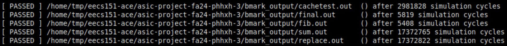

# Ideal memory
{: .no_toc }

Ideal memory is a synchronous component and it always gets the action done the following cycle. Ideal memory only exists in RTL.

## Table of Contents
{: .no_toc .text-delta }

1. TOC
{:toc}

## Benchmarks (sim-rtl)

The total number of cycles to run all benchmarks is 37,738,642.

