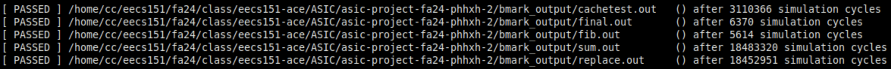
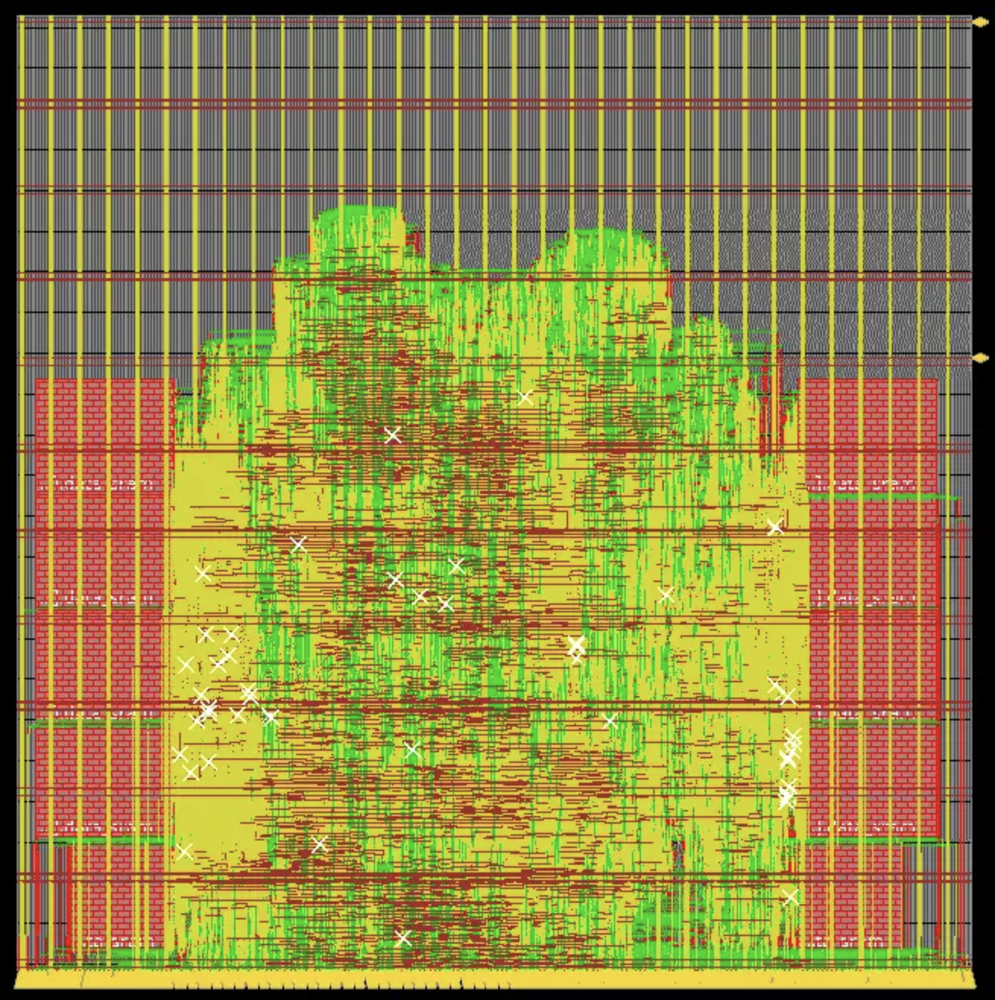

# 1-cyc cache
{: .no_toc }

The table below shows again the latency for various scenarios.

| Case                             | 1-cyc cache (# cycles) |
|:---------------------------------|:-----------------------|
| read hit                         | 1                      |
| write hit                        | 2                      |
| read miss => load                | 6                      |
| write miss => load               | 7                      |
| read miss => write back => load  | 14                     |
| write miss => write back => load | 15                     |

## Table of Contents
{: .no_toc .text-delta }

1. TOC
{:toc}

## Benchmarks (sim-rtl)

### Direct-mapped cache

The total number of cycles to run all benchmarks is 40,058,621. Compared to the number of cycles with the 2-cyc cache, there is a 31% reduction.

<p align="center">

</p>

## Post-synthesis

The synthesis result is generated together with PAR.

### Direct-mapped cache

We are able to achieve 11.5ns clock period post-synthesis with 629ps slack. The timing report is [here](syn_result/direct-mapped_cache/7ns/final_time_ss_100C_1v60.setup_view.rpt). It suggests that synthesis without PAR can achieve lower clock period.

## Post-PAR

### Direct-mapped cache

We are able to get 11.5ns clock period after PAR. The timing report is [here](par_result/direct-mapped_cache/riscv_top_postRoute_all.tarpt). The total time required for running all benchmarks is:
```math
T_{total} = \sum N_{cycles} \times T_{clock} = 40,058,621 \times 11.5ns= 0.461s
```

Below is the screenshot of the floorplan.

<p align="center">

</p>