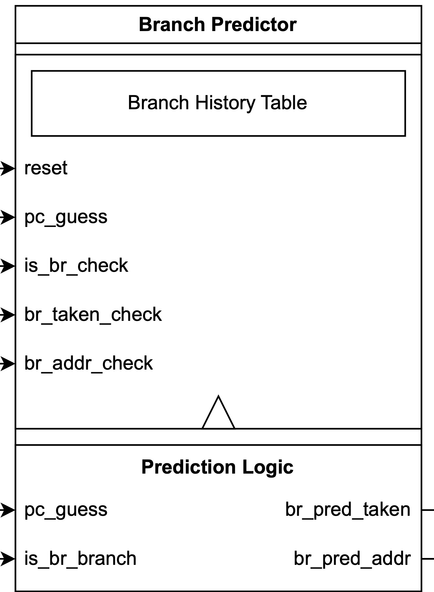
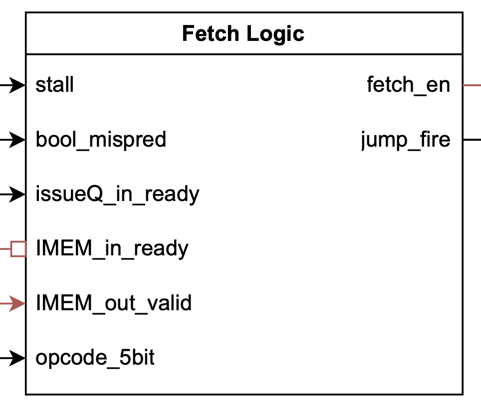

# Single-fetch
{: .no_toc }

This section provides some technical details about the single-fetch frontend.

## Full design diagram with Single-fetch frontend

The design diagram is the same as the diagram provided in the backend section. A PDF version with clear details can be found [here](single-fetch_diagram.pdf).

## Single-fetch frontend

### Branch predictor

In the frontend, we are using a branch history table (BHT) to predict branch is taken or not, as well as a branch target buffer (BTB) to store the latest branch address. By removing the branch address calculation in the fetch stage and only referencing the branch address from the BTB, we get rid of 40% of our critical path (15ns to 9.05ns post-PAR). If a branch is predicted to be taken, we feedback the branch address to the input of instruction memory and PC register, such that we are able to smoothly jump to the new address without any stall. After the branch unit verifies the branching result, it will update the BHT and BTB accordingly. 

`is_br_branch` can be procuced based on the fetched instruction. In the full design diagram there is a `Branch Precalculator` to do the comparison (previously used to calculate the branch address as well). But a simple way is just to set `is_br_branch` to 1.

### Fetch logic

Fetch logic generates the control signal to control the PC register and instruction memory, as well as sends the "jump_fire" signal to the branch unit to let it move forward in case of a branch misprediction.

For the single-fetch frontend, `issueQ_in_ready` should correspond to whether the issue queue is one entry to full to avoid overflow. This is because the issue queue status signal is two flip-flops away from the `fetch_en` signal that controls the instruction cache.