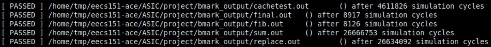
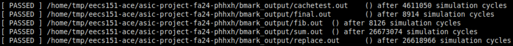
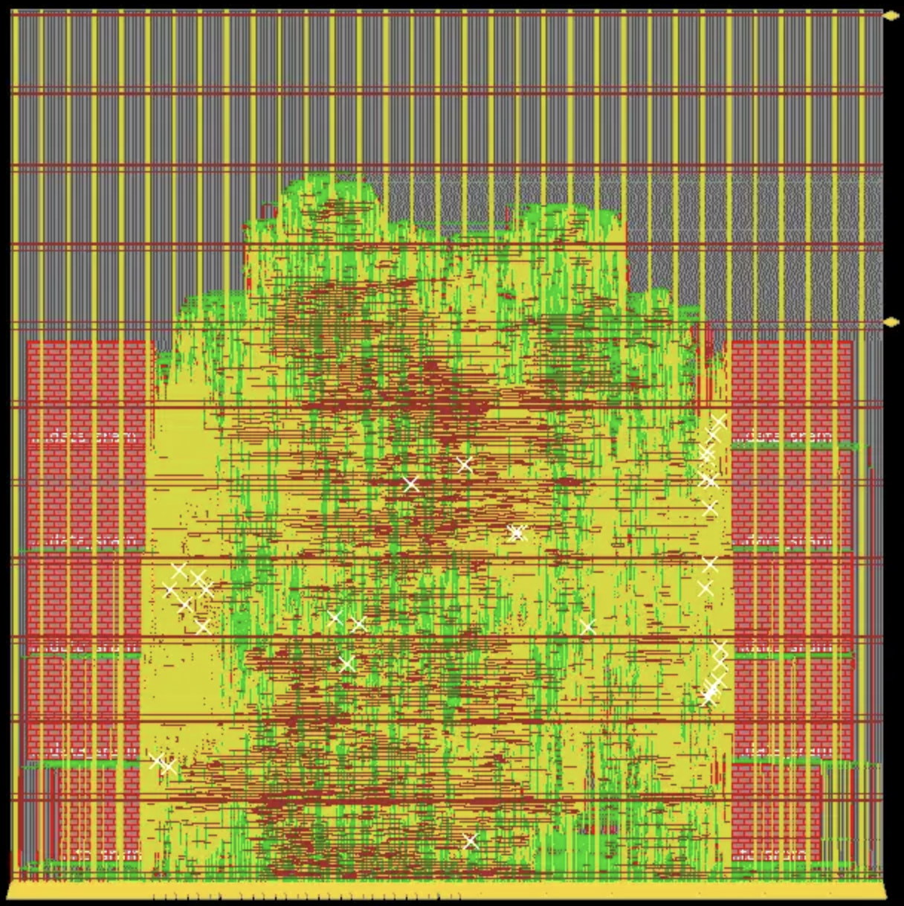
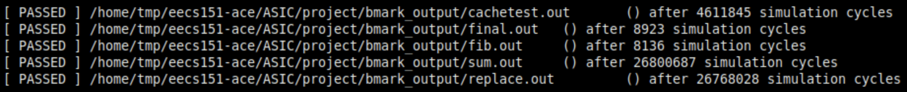
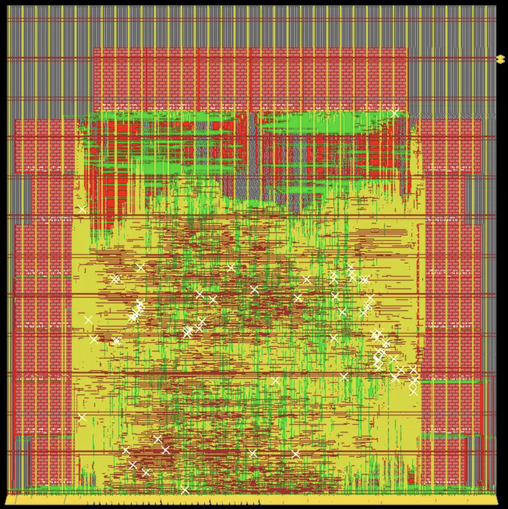

# 2-cyc cache
{: .no_toc }

The table below shows again the latency for various scenarios.

| Case                             | 2-cyc cache (# cycles) |
|:---------------------------------|:-----------------------|
| read hit                         | 2                      |
| write hit                        | 3                      |
| read miss => load                | 6                      |
| write miss => load               | 7                      |
| read miss => write back => load  | 14                     |
| write miss => write back => load | 15                     |

## Table of Contents
{: .no_toc .text-delta }

1. TOC
{:toc}

## Benchmarks (sim-rtl)

### Direct-mapped cache

The total number of cycles to run all benchmarks is 57,929,714.

<p align="center">

</p>

### 2-way set-associative cache

The total number of cycles to run all benchmarks is 57,920,130.

<p align="center">

</p>

## Post-synthesis

Post-synthesis results are NOT up-to-date with the design, but changes are small and won't affect the overall picture. Synthesis documents are stored [here](syn_result). 

### Direct-mapped cache

We are able to achieve 7ns clock period post-synthesis with timing met. The timing report is [here](syn_result/direct-mapped_cache/7ns/final_time_ss_100C_1v60.setup_view.rpt).

### 2-way set-associative cache

We are able to achieve 8ns clock period post-synthesis with timing met. The timing report is [here](syn_result/2-way_cache/8ns/final_time_ss_100C_1v60.setup_view.rpt).

## Post-PAR

Post-PAR results are NOT up-to-date with the design, but changes are small and won't affect the overall picture. With the latest design we can slightly improve the clock to 9ns or even below it (to be verified). PAR documents are stored [here](par_result).

### Direct-mapped cache

We are able to get 9.05ns clock period after PAR. The timing report is [here](par_result/direct-mapped_cache/riscv_top_postRoute_all.tarpt). The total time required for running all benchmarks is:
```math
T_{total} = \sum N_{cycles} \times T_{clock} = 57,929,714 \times 9.05ns= 0.524s
```
Below is the screenshot of the floorplan.

<p align="center">

</p>

##### Benchmarks (sim-gl-par)

After running sim-gl-par for more than a day, we were able to pass all benchmarks after PAR with a slightly increased number of cycles. The result is shown below:

<p align="center">

</p>

A more accurate post-PAR running time for benchmarks is:
```math
T_{par-total} = \sum N_{par-cycles} \times T_{clock} = 58,197,619 \times 9.05ns= 0.527s
```

### 2-way set-associative cache

We are able to get a 12.5ns clock period after par. The timing report is [here](par_result/2-way_cache/riscv_top_postRoute_all.tarpt). It will be slower to run the benchmarks than the direct-mapped cache, so we just skip the calculation. Below is the screenshot of the floorplan.

<p align="center">

</p>

