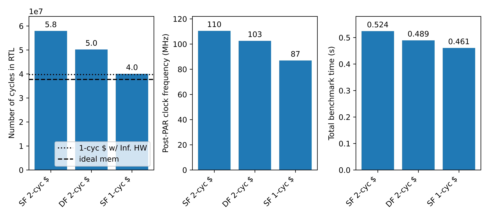

# Result summary
{: .no_toc }

## Table of Contents
{: .no_toc .text-delta }

1. TOC
{:toc}

## Benchmark summary

The plot above combines the number of cycles to run all benchmarks in RTL, the post-PAR clock frequency and total execution time for all benchmarks for the following three configurations: single-fetch (SF) 2-cyc cache, dual-fetch (DF) 2-cyc cache, and single-fetch (SF) 1-cyc cache. We can see that the difference in number of cycles is largely mitigated by the trade-off in clock frequencies, resulting in just 12% speedup in the total execution time (fastest to slowest). The black dotted line indicates the number of cycles for SF 1-cyc cache if we set the table sizes to be large enough such that backend is always working. The SF 1-cyc cache with default table sizes is already very close to the SF 1-cyc cache with infinite hardware resource. The black dashed line indicates the number of cycles for SF ideal memory to run all benchmarks. The SF 1-cyc cache has only 6% more number of cycles compared to it. This suggests 1-cyc cache is pretty much optimized in terms of number of cycles.

## Conclusions

- Critical path usually involves cache, that makes SF 2-cyc cache appealing if high clock frequency is desired
- Benchmark time is limited by the data harzard chain throughout the program, which involves memory multiple times, as discussed in [Dual-fetch/Ideal memory]()

## Potential optimizations

- Speculative load/store execution => reduce data harzard chain
- Further improve the branch predictor => jal/jalr can also utilize a history table and target buffer
