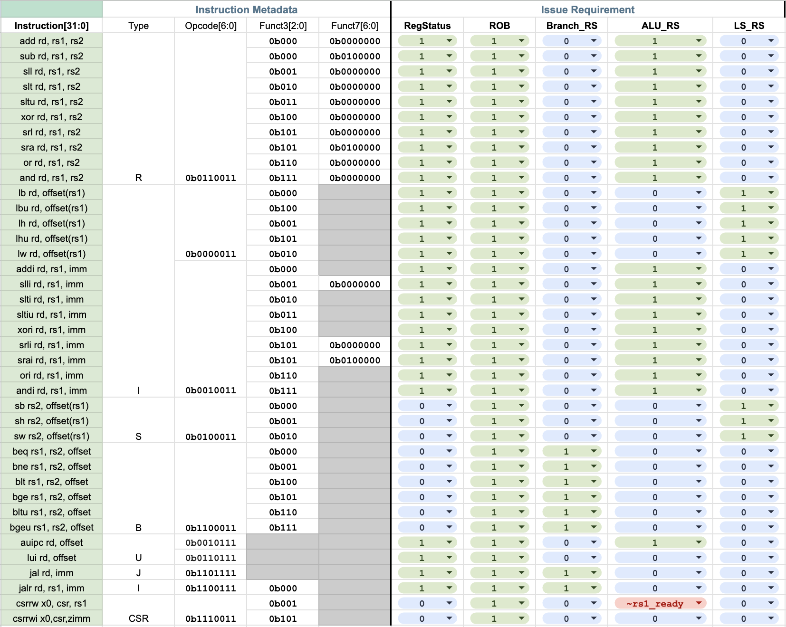

# Design of a dual-issue out-of-order execution RISC-V CPU with branch predictor
Members: Shuqi Xu (<sqxu@berkeley.edu>), Andris Huang (<andrewhz@berkeley.edu>)

## Highlight: Out-of-order execution
We designed a CPU with out-of-order execution (OoOE) using the Tomasulo algorithm adapted from the [LEN5 architecture](https://webthesis.biblio.polito.it/13205/1/tesi.pdf). The main motivation behind the choice of OoOE is to increase the functional units' utilization rate to reduce the pipeline's latency. This scheme is especially appealing when complex operations are executed, where one instruction that takes multiple cycles to complete can unnecessarily stall the entire pipeline for an in-order processor. In our OoOE processor, the instructions are dynamically scheduled so that when, for instance, a cache miss occurs, the following instructions that do not depend on the data can be executed first.

## Design brief
Our design has an issue block FIFO to store fetched instructions, a reorder buffer (ROB) FIFO to store the instruction order and commit the result when it is ready, a register status table to store which ROB entry will commit the result, and three reservation stations (RS) for branching instructions (B-type, jal, jalr), ALU instructions (R-type, I-arithmetic-type, auipc, csrrw if `rs1` is not ready), and load/store instructions (I-load-type, S-type). Some instructions will just issue the ready result to ROB (lui, csrrwi, csrrw if `rs1` is ready). Each RS is connected to its dedicated execution unit, i.e. branch unit, ALU unit, and memory unit. When the execution result is ready from the execution unit, its RS will broadcast the result to other RS and ROB through the common data bus (CDB). RS will choose an instruction that has all operands ready to execute. With CDB to transmit data among RS, RS to choose ready instructions to execute, and ROB to commit in program order, our CPU is able to execute instructions out-of-order. A high-level illustrative diagram is shown below.

### Instruction issue requirement
The sheet below summarizes the required modules to be edited for each instruction during the issue phase.

## Version summary
We've made two versions of the frontend architecture: single-fetch (SF) and dual-fetch (DF), and two versions of cache latencies: 1-cycle-read (1-cyc) and 2-cycle-read (2-cyc). All versions use a dual-issue backend CPU and a configurable set-associative write-back cache, with the default being a direct-mapped cache. 1-cyc/2-cyc refers to that if the cache hits for read, it takes 1-cycle/2-cycle to output valid data. In a SF configuration, the cache always outputs 1 valid word while with DF the cache can output 2 words if `addr[31:4]` is the same for both input addresses. To compare the performances, we mainly tested three versions explained in later sections: 0) SF CPU with 2-cyc cache, 1) SF CPU with 1-cyc cache, and 2) DF CPU with 2-cyc cache. Version 0 is treated as the main design with a detailed explanation of the design and full test results, while the other versions have simplified results for comparison only. Version 0 is also the setup that we submitted for the design contest.

## Contest design doc
A brief version of the design doc submitted for the contest can be found [here](docs/general/Final_design_doc.pdf). We have made several improvements after the initial submission of the design doc (earlier version than the linked pdf):

- Added `sim-rtl` benchmark results for direct-mapped cache, 2-way set associative cache, and ideal memory
- Added PAR results for direct-mapped cache and 2-way set associative cache
- Fixed x0 forward bug in `issue_logic_2.v`
- Defaulted cache associativity to 1, which makes it a direct-mapped cache
- Reduced branch predictor history table size from 128 to 16, which doesn't hurt performance
- Stored branch address in the branch history table, doesn't need to calculate branch address in the instruction fetch stage
- Decreased the clock period for direct-mapped cache (15ns to 9.05ns), and 2-way set associative cache (16ns to 12.5ns) after removing the aforementioned branch address calculator
- Added `sim-gl-par` result for direct-mapped cache
- Implemented the cache with 1-cycle-read, and 2-cycle-write if cache hits (previously was 2-cycle-read, and 3-cycle-write if cache hits)
- Impplemented a dual-fetch frontend (previously was single-fetch frontend)
- Decoupled store_valid and store_ready in `commit_logic_2.v`
